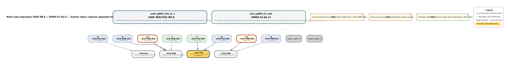
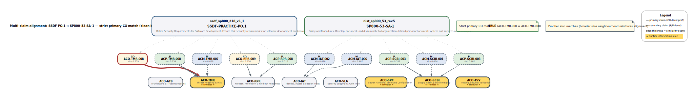
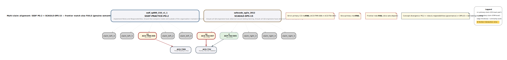

# Pressure-Testing AppSec Core: A Design Science Cycle for Bounded-Ontology Evolution Under Heterogeneous Application-Security Sources

**Pedro Farinha**
Independent Researcher
[pedro.farinha@shiftleft.pt](mailto:pedro.farinha@shiftleft.pt)

*Supported by Shiftleft — Secure Software Engineering, lda.*

---

## Abstract

Heterogeneous application-security (AppSec) reference sources — frameworks, standards, regulations, attack taxonomies, and emerging AI-domain guidance — describe overlapping practices in incompatible structures, vocabularies, and granularities. This paper reports the design science cycle through which an initial AppSec normalization pipeline, bounded by design at five first-wave sources and using a keyword-first heuristic, was iteratively refined under the pressure of expansion to a thirty-one-source corpus across three iterations. Iteration 1 replaced the keyword-first heuristic with a method structured in two architectural layers — a sentence-embedding similarity pipeline computed over a hierarchy-lifted-flattening representation, plus three curation disciplines surrounding it (the v1.0 augmentation rule that integrates source-side structural context into the embedding signal, tier-based curation-effort calibration matching per-source decomposition granularity, and explicit per-item override mechanism with rationale records). Iteration 2 exercised the AppSec Core Change Request (ACR) protocol — the cycle's governance instrument for ontology change — across four candidate cases: two were promoted as carried forward from the first-wave baseline, one was decided not to apply, and one new candidate was promoted under the same threshold. Iteration 3 pressure-tested the bounded thesis — that the ontology absorbs new pressure additively without structural redesign — by extending the corpus with five AI/ML-focused sources under the author's declared assumption that ontology extension must not be driven by technological novelty alone; the ontology held under the extension and the iteration 2 ACR slate is reported as final at this stage. The cycle was accepted on a stated *good-for-intended-fit* criterion operationalised through four evidence pillars (structural conformance under SHACL Core; per-source coverage acceptable under independent third-party cross-references; multi-mode evaluation returning no failure-class signal; rejection of random source-claim assignment under permutation-test null model with semantic-specialisation direction), with the criterion anchored to a two-fold purpose: bounded coverage of essential AppSec concepts for an ontology-grounded code-generation consumer, and iterative completeness of the practitioner Manual that complements the ontology. Independent-research scope is declared honestly: there is no subject-matter-expert panel, no inter-rater reliability measurement, no peer-validated submission of individual mappings. The cycle's outputs — a refined method published as a reusable artefact, a thirty-one-source coverage map with three-way routing of source content (Core-mapped within the bounded ontology, Manual-only for substance outside the ontology's bounds but in the practitioner Manual's comprehensive prose corpus, out-of-AppSec), and an OLIR-compatible publication form for per-source-to-ontology mappings — are released under SHA-256-pinned configuration as the first instantiation of a workflow that is itself reusable for new-source onboarding and project-level compliance assessment going forward.

**Keywords:** Design Science Research, application security, ontology normalization, ontology matching, sentence embeddings, OLIR, IR 8477, deterministic pipeline, independent research

---

## 1. Introduction

### 1.1 The problem context

Software engineers building or maintaining a security-relevant application have to satisfy security requirements derived from a heterogeneous body of authoritative sources: prescriptive standards (e.g., NIST Secure Software Development Framework, OWASP Application Security Verification Standard), supply-chain integrity references (e.g., Supply-chain Levels for Software Artifacts), enterprise control catalogs (e.g., CIS Critical Security Controls), problem-space taxonomies (e.g., MITRE Common Attack Pattern Enumeration and Classification), maturity models (OWASP SAMM, OWASP DSOMM), regulatory instruments (DORA, NIS2, the EU Cyber Resilience Act, GDPR), and an emerging AI-domain layer (MITRE ATLAS, the OWASP Top-10 for Large Language Model Applications, the OWASP Top-10 for Machine Learning, NIST AI 100-2, the NIST AI Risk Management Framework). These sources overlap in substance but disagree in vocabulary, in unit of decomposition, in granularity, and in the kind of question they answer. The same engineering practice — for example, validating untrusted input before use — appears in different sources under different names, at different levels of decomposition, and embedded in different structural contexts.

For a software engineer to act on this body of guidance, the heterogeneous sources have to be **normalized** into a single representation that supports per-source extraction of what is engineering-actionable in the software development lifecycle. The earlier programme work this paper extends [1] introduced AppSec Core, a bottom-up ontology built from practitioner experience, partitioned into ten domain slices by the operational control surface at which a security control converges in the delivered software lifecycle (the build pipeline, the identity layer at runtime, the input boundary, the release gate, the audit-log surface, etc.). The companion compilation paper [2] applied AppSec Core to a deliberately bounded set of five first-wave sources using a simple keyword-first normalization heuristic, sufficient to demonstrate that the ontology bounded an interpretable substrate but explicitly insufficient to claim that the bounding would hold under wider source pressure.

Two open questions remained at the end of the first wave. First, would the ten-slice partition and the four-type instance schema absorb expansion to a substantively wider corpus — including maturity models, regulatory instruments, federal control catalogs, and AI-domain guidance — without requiring boundary redesign? Second, would a keyword-first heuristic, appropriate at cluster-level granularity over five sources, still be appropriate when scaled to per-item granularity over twenty-six and then thirty-one sources? The two questions are entangled. Answering the first requires applying the ontology to the wider corpus; applying the ontology requires a method that operates at instance-level granularity; an instance-level method has to replace the cluster-level keyword-first heuristic.

### 1.2 What this paper reports

This paper reports the **design science cycle** through which both questions were answered jointly, across three iterations under the pressure of expansion from five to thirty-one sources. The cycle is a Design Science Research engineering trajectory in the sense of Hevner et al. [21] and Wieringa [22]: an artefact-producing discipline in which a method, an ontology, and a coverage map co-evolved under documented evaluation criteria, terminating at acceptance under a stated *good-for-intended-fit* criterion.

The cycle is reported here as an **engineering trajectory**, not as a single before-and-after comparison. Iteration 1 refined the method (§4): the keyword-first heuristic was replaced by a **two-layer architecture** — a sentence-embedding similarity pipeline computed over a hierarchy-lifted-flattening representation, surrounded by three curation disciplines (an augmentation rule that integrates source-side structural context into the embedding signal, tier-based curation-effort calibration matching per-source granularity, and an explicit per-item override mechanism preserving the audit-traceable distinction between pipeline candidate and curated decision). Iteration 2 exercised the **AppSec Core Change Request (ACR) protocol** (§5) — the cycle's governance instrument for ontology change, defined separately in the artefact paper companion to this cycle — across four candidate cases: two carried forward from the first-wave baseline (the *Secure Configuration Baseline Integrity* candidate and the *Security Requirements Lifecycle Management* candidate, encoded as ACR-001 and ACR-002 within the protocol) were promoted; one new candidate (an adjunct cluster identified during the cycle, encoded as ACR-003) was decided not to apply; one further candidate surfaced by re-application of the refined method (the *Output Rendering Safety / Context-Aware Encoding* candidate, encoded as ACR-004) was promoted. Iteration 3 pressure-tested the bounded thesis (§6): the corpus was extended with five AI/ML-focused sources under the author's declared no-tech-novelty assumption, and the resulting substrate was evaluated for whether further ontology change was warranted. The substantive finding is reported in §6.4: cross-source convergence was *detected* under the extended corpus but the existing ontology absorbed the convergence at adjacency consistent with prior problem-space-inverted source baselines, and no new ACR was warranted; ACR-004 is reported as the cycle's last promoted change at this stage.

### 1.3 The two surfaces and the two-view architecture

The cycle's acceptance criterion (§8) is anchored to a **two-fold purpose** that distinguishes this work from a generic ontology-normalization study. The cycle is a component of a research programme [3] whose downstream consumer is an MCP-grounded apparatus that combines the bounded ontology with a prescriptive practitioner Manual to deliver a security-requirements harness to engineers and to large-language-model assistants used during development [6]. The cycle's outputs are produced for that consumer; the cycle's acceptance criterion is therefore not generic mapping correctness but *bounded coverage sufficient for that consumer's intended use*.

The programme is structured around two surfaces with asymmetric scope. The **bounded ontology** (AppSec Core) is a typed, validated, machine-readable subset that normalizes the development-and-maintenance substance under per-slice contracts and the AppSec Core Change Request governance protocol. The **practitioner Manual** — the SbD-ToE Manual, where SbD-ToE is shorthand for the Security-by-Design *Theory of Everything* programme of which the Manual is the prescriptive corpus — is **comprehensive**: it carries both engagement-view substance (a subset of which the ontology normalizes into typed entities, with the rest covered in prose) AND organizational-view substance — governance, training, vendor contractual security management, regulatory compliance, workforce programmes — that the ontology does not bound by design. The ontology is, in this sense, a normalized subset of part of what the Manual covers; the Manual is the comprehensive prescriptive corpus.

Two complementary views can be distinguished by the kind of question the consumer is asking:

- **Engagement view (tactical).** *"I have this application to maintain or evolve — what do I have to do, in this code change or this release, so that it meets the security requirements?"* Answered through the bounded ontology (for the engagement-view subset the ontology bounds, with deterministic typed retrieval) and through the Manual's prose layer (for engagement-view substance the Manual carries in prose, whether or not also normalized into the ontology). The temporal scale is per pull request, per sprint, per release.
- **Organizational view (strategic).** *"This application has to live for years — what programme do I need to put in place around it?"* Answered through the Manual's prose layer only; the bounded ontology has no surface for this view by design — its bounds exclude organizational substance.

The two views are operationally distinguishable but architecturally interdependent. Organizational substance — governance, direction, mission, training, vendor authority, policy — provides the necessary conditions under which tactical engagement-view practice is implementable; an engineer who has not been trained cannot apply secure-coding practices, an organisation without authorised toolchain cannot execute static analysis, a programme without policy authority cannot block insecure dependencies. Conversely, organizational objectives only realize through tactical implementation; governance frameworks that cannot be operationalised in code, build pipelines, runtime controls, and audit logs are, in practical effect, theatre. The two views are complementary lenses on a single underlying programme, not a partition of AppSec content.

This architecture has two consequences for the cycle reported here. First, the cycle's per-source-item routing decision is **operational categorisation** of where the source-item informs programme surfaces — whether it falls within the ontology's bounds (and thus is normalized into a typed Core entity *and* expected in the Manual's prose), or whether it is in scope for AppSec but outside the ontology's bounds (in which case the Manual's prose layer is the surface that must cover it). Second, the downstream consumer — the harness delivered to engineers and to language models — combines both surfaces by architectural necessity, not by convenience: a consumer trying to act on the typed ontology alone, without the Manual's prose layer for substance the ontology does not bound, cannot make a decision the application's lifecycle will sustain.

### 1.4 The cycle's two-fold purpose

The two-fold purpose stated below is the **intended fit AppSec Core must satisfy for the downstream consumer** — the programme-level use of AppSec Core in the engagement-view harness of §1.3, against which the *good-for-intended-fit* acceptance criterion of §8 is calibrated. This is distinct from what the present DSR cycle paper sets out to *show*: the documentation of the iterative process by which the bounded ontology was brought to adequacy and the bounded thesis was pressure-tested. The cycle paper's documentation-purpose covers the three-iteration trajectory: Iteration 1 (method refinement, §4) and Iteration 2 (ACR governance exercise, §5) establish ontology adequacy across the twenty-six-source baseline, and Iteration 3 (§6) extends the corpus with five AI/ML-focused sources under the author's declared no-tech-novelty assumption (§6.1) that tech novelty alone does not motivate ontology change. The legitimate question Iteration 3 answers is whether AI/ML pressure surfaces engineering-practice convergence the existing ontology cannot represent. AppSec Core's use-purpose anchors the criterion against which adequacy is judged; the cycle's documentation-purpose anchors what this paper contributes as a Design Science Research engineering record. The two are complementary: a paper that reported only the use-purpose acceptance verdict without the iteration trajectory would be an apparatus paper, not a DSR paper; a paper that reported only the trajectory without anchoring it to a defined intended fit would be a methodology narrative, not an engineering record.

Within the two-surface architecture of §1.3, the two-fold use-purpose has the following facets:

- **Purpose 1 — Bounded ontology coverage.** The bounded ontology must contain the essential development-and-maintenance substance for the downstream harness to deliver actionable security requirements per code change. The criterion is not 100% cross-source mapping precision; it is *routing correctness* (each external item lands in the surface it informs — within ontology bounds, within Manual scope but outside ontology bounds, or out-of-AppSec) and *ontology bounding* (the ontology's content covers the essential development-and-maintenance substance under multi-source pressure).
- **Purpose 2 — Iterative Manual completeness across both views.** The cycle's gap-detection signal must cover both engagement-view substance (where the ontology bounds it AND where the Manual must carry it in prose) and substance the ontology does not bound (organizational-view substance, plus any engagement-view substance the Manual covers in prose without ontology normalization). The Manual is the comprehensive prescriptive corpus; ensuring substance falling outside the ontology's bounds is nonetheless covered in the Manual's prose is part of the cycle's job, not a downstream concern. Gap signals are specific enough to prompt the Manual's author to fill missing content incrementally.

The *good-for-intended-fit* criterion (§8) is calibrated to these two purposes, operationalised through four pillars (structural conformance under SHACL Core, per-source coverage acceptable under independent third-party cross-references, multi-mode evaluation returning no failure-class signal, rejection of random source-claim assignment under permutation-test null model with semantic-specialisation direction), and qualified by an honest **author-constraint rationale**: this is independent research, conducted without a subject-matter-expert panel, without inter-rater reliability measurement, and without peer-validated submission of individual mappings. Subject-matter-expert review, inter-rater κ measurement, and peer-validated submission to a programme such as NIST OLIR are out of scope of this paper and registered as future work (§13). The contribution is the cycle and its outputs at the maturity attainable under stated constraints, with the constraints declared rather than masked.

### 1.5 Contributions

The paper makes four contributions, each verifiable against the cycle's published artefacts:

**Contribution 1 — The design science cycle as a three-iteration engineering trajectory producing a reusable workflow.** The cycle is the first instantiation of a workflow that can be re-invoked: to onboard a new external source (re-applies the routing discipline to determine its development-lifecycle implications and whether new ontology change is warranted), to assess a project's compliance against the normalized substrate (Core-mapped alignment, Manual-only alignment, gap detection), and to deliver the resulting harness to language-model consumers used during development, code review, and audit. The reusability is qualified by two operational properties the cycle aims to deliver: rapid application (the workflow scales to new sources or projects without per-item expert curation) and bounded confidence (calibrated to the declared acceptance criterion, not to subject-matter-expert-certified correctness). The cycle's **routing yield** at first instantiation: of the 3,861 source items extracted from thirty-one sources, the cycle's three-way routing (§10) places each item in one of three destinations — *Core-mapped* against the bounded ontology's 259 typed instances (75 ControlObjectives + 69 Practices + 58 Mechanisms + 57 Artifacts) at a per-source-and-per-direction-conditioned mean fan-in ratio (per Tables 5–6 of §6.7), *Manual-only* for substance outside the ontology's bounds but within the practitioner Manual's scope, and *out-of-AppSec* for non-AppSec content. The yield is a routing summary, not an information-theoretic compression: Core-mapped items reduce many-to-one onto ontology entities (within-direction fan-in), Manual-only and out-of-AppSec items are routed away from the ontology by design, and the ontology's 259 typed instances are reached by a deliberate populate-by-routing process rather than by lossless compression of all 3,861 items. Runtime instantiation of the ontology surface against a specific project's risk profile (the consumer's engagement-view query against Core + Manual) is reported in the downstream apparatus papers [6, 8]; this paper reports the cycle that produces the substrate, not the runtime instantiation.

**Contribution 2 — The refined normalization method, structured in two architectural layers, published as a reusable method-artefact.** A single computational pipeline (sentence-embedding similarity over a hierarchy-lifted-flattening representation, encoded with `sentence-transformers/all-MiniLM-L6-v2` [27, 28]) plus three curation disciplines surrounding it: (i) the *v1.0 augmentation rule* that integrates source-side structural context into the embedding signal symmetrically on the source and reference sides; (ii) *tier-based curation-effort calibration* matching per-source decomposition granularity (per-item curated for fine-grained sources; per-section curated with gap resolution; per-family with inheritance; bounded heuristic with explicit flagging only at coarsest granularity); (iii) *explicit per-item override mechanism* with rationale records preserving audit-traceable distinction between pipeline candidate and author-curated decision. The two-layer architecture replaces the keyword-first heuristic of the first-wave baseline [2] for fine- and mid-granularity sources; for coarsest-granularity sources a bounded heuristic with explicit flagging is retained as Tier 4 of the curation-effort calibration. The method is published as a method-artefact under SHA-256-pinned configuration, with the pipeline and the three discipline files released together at the cycle-close release tag. Sub-iterations on the pipeline configuration and the augmentation rule are reported *en passant* — the published configuration is the cycle's final base; sub-iteration outputs have no standalone scientific value and are not advanced as independent contributions.

**Contribution 3 — The thirty-one-source coverage map with three-way routing discipline.** The substrate produced at cycle close (substrate version *v7*, SHA-256-pinned at the cycle-close release tag) records 3,861 items decomposed from 31 source documents into 18,673 normalized claims, routed into three categories: (a) **Core-mapped** items — items whose substance falls within the bounded ontology's bounds, normalized into a typed Core entity and expected to be present in the Manual's prose; (b) **Manual-only** items — items whose substance is in scope for AppSec but outside the ontology's bounds, covered by the Manual's prose layer (organizational substance such as governance frameworks, training programmes, vendor contractual security management, regulatory compliance regimes under DORA / NIS2 / the EU Cyber Resilience Act / GDPR, and workforce programmes; plus any engagement-view substance the Manual covers in prose without ontology normalization); (c) **Out-of-AppSec** items not relevant to application security as scoped (generic IT controls, infrastructure-only concerns, enterprise-asset management). The cycle does not claim 100% cross-source mapping precision; it claims routing correctness within the operational discipline and ontology bounding under multi-source pressure. Substrate generation runs as a deterministic Python pipeline without language-model invocation (§11), and the per-source-into-Reference orientation contrasts with runtime language-model-assisted matchers (§14.4).

**Contribution 4 — A per-source-into-Reference mapping methodology, packaged in OLIR-compatible publication form.** The cycle's methodological contribution at the publication-form level is an **orientation distinct from established cross-framework cross-mapping practice**: rather than producing reciprocal source-to-source mappings (the orientation of NIST OLIR submissions and of cross-mapping projects such as OpenCRE, where each pair of frameworks is related to each other), the cycle produces **per-source mappings into a single common ontological reference** (the bounded ontology), with the reference acting analogously to NIST OLIR Reference Documents but populated by a bottom-up control-surface decomposition rather than by an authority-side decomposition. The methodological claim is that, for the engagement-view consumer this programme serves, **per-source-into-Reference orientation may be more usable than source-to-source orientation, with empirical comparison registered as future work (§12.3)**: at the design-property level, it scales linearly with the number of sources (each source mapped once to the Reference, rather than to each prior source), it preserves the Reference's bounded coherence under each new source addition, and it admits per-source compositional combination at the consumer side without the consumer having to traverse a source-to-source mapping network. These design properties are reported here as analytical advantages of the orientation; whether they translate into measurable usability gains for the engagement-view consumer under realistic queries is a separate empirical question, registered as future work (§12.3). The cycle's outputs are packaged in the NIST IR 8477 relationship vocabulary and the IR 8278A r1 STRM resource model — form-compatibility with OLIR submission tooling, validated against the NIST OLIR JSON Schema 1.1 with 31/31 per-pilot submissions passing (§12.4) — but the methodological contribution is the orientation, not the form. Cross-framework reciprocal mapping in the OLIR style remains the territory of the NIST OLIR programme and related cross-mapping projects; this cycle's contribution complements, rather than competes with, those efforts. **Declared scope:** the contribution is at the orientation-and-form level. Subject-matter-expert review of individual mappings, κ inter-rater reliability validation, and OLIR-validated peer submission of the per-source-into-Reference mappings are explicitly out of scope and registered as future work (§13).

### 1.6 Out of scope (and where the corresponding work is reported)

The bounded ontology v1 itself — its OWL 2 DL formalization, its SHACL Core constraint set, the populated graph, the structural conformance validation report, the schema-preservation analysis across the v0→v1 transition, and the ACR governance protocol with its threshold definition and worked decisions — is the subject of the artefact paper companion to this cycle [4]. The cycle reported here exercises the protocol; the protocol itself is the artefact paper's claim.

The validation of the practitioner Manual against the cycle's outputs — specifically, the bidirectional Manual-coverage cycle, the edit-versus-traceback decisioning, the knowledge-graph rebuild, and the closure event that freezes corpus + Manual + ontology jointly for downstream consumption — is reported in the downstream pipeline-primitive demonstration paper [5] (which encompasses the Manual-coverage cycle plus the joint Manual + knowledge-graph production at 31-source scale). The cycle reported here ends at "ontology v1 + 31-source coverage map + organizational-view content routed to Manual + documented out-of-scope, accepted as good-for-intended-fit, bounded thesis confirmed under AI/ML pressure".

Retrieval, language-model grounding, the experimental evaluation of grounded versus ungrounded compilation, and the dual-mode apparatus that mediates both — are reported in [6], [7], and [8] respectively.

What stays in this paper, not delegated: convergence *between sources* (e.g., the SSDF cross-reference convergence used as Pillar 2 evidence; the cross-source convergence detected under the AI/ML extension and analysed in §6) is owned here as method evidence and is part of the 31-source coverage map. This is distinct from Manual-coverage convergence, which is the Manual-validation cycle's claim [5].

### 1.7 Document structure

The rest of the paper is organised as follows. §2 describes the cycle's starting point: the v0 ontology and the five-source keyword-first first-wave baseline. §3 reports the trigger for the cycle: expansion to the wider corpus and the tensions the expansion surfaced. §4 reports Iteration 1, the method refinement from keyword-first to a two-layer architecture (pipeline plus three curation disciplines). §5 reports Iteration 2, the ACR protocol's exercise across four candidate cases. §6 reports Iteration 3, the bounded-thesis pressure test under the AI/ML extension. §7 reports the end-to-end re-application of refined method to the cycle-close corpus. §8 states and operationalises the *good-for-intended-fit* acceptance criterion. §9 reports the cycle's substantive outputs. §10 reports the three-way routing across the two surfaces (Core-mapped, Manual-only, out-of-AppSec). §11 reports pipeline determinism (no language-model invocation in substrate or figure generation). §12 reports the OLIR-compatible publication form and its declared scope. §13 states limitations and threats to validity. §14 positions the cycle within the relevant Design Science Research and AppSec normalization literatures. §15 specifies the reproducibility surface, including the AI Use Statement at §15.6. §16 lists references.

---

## 2. Starting point: AppSec Core v0 and the five-source keyword-first baseline

This section describes the cycle's starting state. Nothing in this section is a contribution of the present paper; the section exists to fix the baseline against which the cycle's refinements are measured. Readers familiar with the v0 paper [1] and the v0-era compilation paper [2] may skim §§2.1–2.3.

### 2.1 The v0 ontology

AppSec Core v0 [1] is a normalized ontology for application security comprising ten domain slices and 234 typed instances across four populated entity types:

- **ControlObjective**: a reusable domain constraint or assurance goal, formulated in the verification voice ("the system shall...");
- **Practice**: a reusable human or process discipline through which control objectives are realized in development and operations;
- **Mechanism**: a concrete, enforceable means by which a practice is implemented (a tool, a configuration, a runtime control);
- **Artifact**: a control-relevant or evidence-bearing output (a document, a record, a verifiable signed artefact).

A fifth typed entity, **EvidencePattern**, is declared in v0 as a supporting index of 213 patterns expressing the expected evidence shape for deterministic review. EvidencePattern is a first-class declarative class in the AppSec Core V1 ontology — `EvidencePatternShape` is defined in the apparatus SHACL skin (`appsec-core-v0-shapes.ttl`) at the cycle-close ontology release with `sh:targetClass ac:EvidencePattern`, plus optional property shapes referencing it from ControlObjective (`objective_verified_by_evidence_pattern`) and Artifact (`artifact_supports_evidence_pattern`). The class is intentionally unpopulated at V1: the SHACL conformance report records `target_node_count = 0` for `EvidencePatternShape`, and substrate v7 carries zero EvidencePattern claims (substrate v7 SUPPLIER SHA-256 `596783ed984d…`). The v0 supporting index of 213 evidence patterns — used by the programme's downstream retrieval runtime [6] — is preserved as the runtime-evidence-pattern artefact `evidence_patterns.json` within the cycle's deposited bundle (SHA-256 `89305ffcd279…`; full 64-char digest in §15.0 bundle manifest). The ontology declares the relationship via `appsec-core-evidence-pattern-index-v0.yaml`'s `source_alignment` block, which acts as the canonical pointer between the V1 declarative class and the v0 populated supporting surface. Population of the EvidencePattern class as first-class typed instances at the populated graph is registered as future programme work [4 §10.4]. The 234 / 259 figures reported throughout this paper for the v0 / v1 typed instance counts therefore refer to the four populated entity types only and exclude the EvidencePattern declarative class. Slices are governed by per-slice contracts specifying scope, non-goals, and acceptance conditions, and were derived bottom-up from a practitioner Manual corpus through expert qualitative reading [1, §3]. Each slice has a declared primary control surface — the operational governance locus at which the slice's controls converge in the delivered software lifecycle — captured by a categorical descriptor (`single_broad_control_surface`, `dual_control_surface`, `multi_control_convergent_surface`, `split_control_surface`).

The v0 partition does not claim domain-completeness. It claims to be the contract-disciplined partition that the bottom-up derivation produced [1, §3.5], extensible by adding new contracts where new slice-shaped concerns are identified.

### 2.2 The five-source first-wave bounded baseline

The v0-era compilation paper [2] applied AppSec Core v0 to a first wave of five external sources, chosen to cover distinct operational lenses while remaining bounded:

- NIST Secure Software Development Framework (SSDF v1.1) — prescriptive standard;
- OWASP Application Security Verification Standard (ASVS) — verification standard;
- Supply-chain Levels for Software Artifacts (SLSA) — supply-chain integrity reference;
- CIS Critical Security Controls — enterprise control catalog;
- MITRE Common Attack Pattern Enumeration and Classification (CAPEC) — problem-space taxonomy.

The first wave was a *bounding test* rather than coverage evidence: the five-source set was sufficient to demonstrate that the ontology bounded an interpretable substrate [2], but explicitly insufficient to claim the bounding would hold under wider source pressure. The first wave reported 91 source items mapped at cluster-level granularity, with per-cluster mapping decisions recorded as supplementary material.

### 2.3 The keyword-first normalization heuristic

The first-wave mapping decisions used a **keyword-first heuristic**: each source's item was assigned to a slice by matching domain-vocabulary keywords (the cross-slice vocabulary terms of [1, §3.6]) against the item's text. Where the keyword matched within a slice's domain vocabulary, the item entered that slice's mapping; where multiple keywords matched, the strongest-vocabulary signal won, with explicit per-pilot rationale recorded.

The heuristic was deliberate. At cluster-level granularity over 91 items, the keyword-first approach was auditable per-decision (each mapping is traceable to a keyword match), repeatable (a second analyst applying the same vocabulary to the same source produces, modulo curation judgement, the same cluster-level outcome at the same granularity), and cheap enough to apply across the first wave at first-wave resourcing. The cluster-level coverage outcomes of the first wave (78% direct coverage rising to 95% after gap resolution at cluster granularity; four genuine content gaps identified) demonstrated the bounding adequacy of the v0 ontology at the first-wave granularity [2, §6].

### 2.4 Two known limitations carried into the cycle

The keyword-first heuristic had two known limitations at instance-level granularity, declared in [2, §7]:

1. **Section-title exclusions.** Items whose containing section title did not include the matched keyword were systematically missed, even where their content was within the slice's substantive scope.
2. **Vocabulary mismatches.** Items whose source-chosen terminology did not include any cross-slice-vocabulary keyword were missed, even where their content was within scope.

Both limitations were tolerable at cluster-level granularity (where each cluster contains many items, and a single keyword match per cluster is sufficient for the cluster-level decision) but expected to compound at instance-level granularity. The cycle reported below began from this declared expectation.

---

## 3. The trigger: expansion under multi-source pressure

### 3.1 The expanded twenty-six-source corpus (cycle baseline)

The cycle reported in this paper began with an expansion of the corpus from the first-wave five sources [2] to a baseline of twenty-six sources drawn from eleven organisational authorities, summarised by category in Table 1.

**Table 1.** AppSec Core cycle baseline at iteration entry — twenty-six sources by operational-lens category. Sources retained from the first wave [2] are marked with an asterisk. The mapping direction (solution-direct / problem-inverted / mixed) is per source's primary stance and is the determinant for the cycle's tier-based mapping discipline (§4.2.3).

| Operational lens | Sources (with refs) | Mapping direction |
|---|---|---|
| Lifecycle prescription (federal) | NIST Secure Software Development Framework v1.1 [9]* | Solution-direct |
| Verification standard | OWASP Application Security Verification Standard v5.0 [10]* | Solution-direct |
| Supply-chain integrity | Supply-chain Levels for Software Artifacts (SLSA) v1.0 build track [11]* | Solution-direct |
| Enterprise control catalogue | CIS Critical Security Controls v8.1.2 [14]*; NIST Special Publication 800-53 r5 [18] | Solution-direct |
| Problem-space taxonomy | MITRE Common Attack Pattern Enumeration and Classification (CAPEC) v3.9 [15]*; MITRE Common Weakness Enumeration (CWE) Software Development view v4.19.1 [43] | Problem-inverted |
| Maturity model | OWASP Software Assurance Maturity Model v2.1 [16]; OWASP DevSecOps Maturity Model (DSOMM) [17] | Mixed |
| Regulatory overlay (EU) | EU Digital Operational Resilience Act (DORA); EU Network and Information Systems Directive 2 (NIS2); EU Cyber Resilience Act (CRA); General Data Protection Regulation (GDPR / RGPD) | Mixed (governance + technical) |
| Healthcare regulatory | HIPAA Security Rule | Mixed (governance + technical) |
| Payment-industry guidance | PCI Software Security Framework v1.1 (SSLC); PCI Data Security Standard v4.0.1 (DSS) | Solution-direct |
| Defender top-list / proactive guidance | OWASP Top-10 (web) 2021; OWASP Proactive Controls 2018 | Top-N defender (Top-10 problem-inverted Top-N format; Proactive Controls solution-direct) |
| Industry consortium / practical guidance | SAFECode Agile (2012); SAFECode Fundamental Practices for Secure Software Development (FPSSD, 2018); SAFECode Software Integrity Controls (SIC, 2010) | Mixed |
| AI / MCP domain guidance (baseline edition) | ENISA Multilayer AI Cybersecurity Practices 2023; OWASP Top-10 for Model Context Protocol Applications v0.1 2025 beta [44]; OWASP MCP Secure Server Development v1.0; OWASP MCP Third-Party Servers v1.0; MCP Official Security Foundations 2025 | Mixed (problem-inverted on attack-side substance; solution-direct on defender substance) |

The selection criterion was *organisational-authority spread* (eleven distinct authorities at the iteration-entry corpus, broadening to additional authorities through the AI/ML extension reported in §6) combined with *coverage of the operational lenses* (lifecycle prescription, verification, supply-chain integrity, enterprise controls, problem-space taxonomy, regulatory overlay, maturity assessment, AI-domain guidance available at the baseline edition's date).

The canonical per-source list of all twenty-six baseline sources, with per-source identifiers, sub-version references, and tier assignments under the method (§4.2.3), is published as part of the substrate's per-pilot configuration files at the cycle-close release tag (§15.2). Table 1 above groups the sources by operational-lens category for reader navigation; Table 3 (§6.2) enumerates the five iteration-3 extension sources individually; together the two tables cover the thirty-one-source cycle-close corpus, with the per-source canonical list at the substrate release tag as the single ground-truth reference.

### 3.2 Tensions the expansion surfaced

Re-applying the v0-era keyword-first heuristic to the wider corpus surfaced two classes of tension immediately, consistent with the limitations declared at v0-era closure (§2.4):

- *Granularity tension.* Items extracted at instance-level granularity (3,000+ items at cycle baseline) exposed the keyword-first heuristic's section-title exclusions and vocabulary mismatches at a scale that compounded substantively, not marginally.
- *Cross-source convergence tension.* Multiple sources, authored independently and with different vocabularies, addressed the same engineering-practice substance (for example, secure baseline configuration, security-requirements lifecycle management). At cluster-level granularity over five sources this kind of convergence was subordinate to the bounding question; at instance-level granularity over twenty-six sources it became the substantive signal that the cycle's ontology-side iteration would have to address.

### 3.3 The AppSec Core Change Request (ACR) protocol — concept and governance

Before reporting how the cycle handled these tensions, this section introduces the **AppSec Core Change Request (ACR) protocol**. The protocol's full definition, threshold conditions, and worked decisions are the subject of the artefact paper companion to this cycle [4]; this paper exercises the protocol and reports the decisions but does not claim the protocol itself as a contribution.

In short: an ACR is a candidate change to the bounded ontology — a candidate new ControlObjective, Practice, Mechanism, or relation, or a candidate scope adjustment to an existing slice — submitted under an explicit four-condition threshold:

1. *Multi-source convergence:* the candidate's substance appears across **at least five independent sources** drawn from at least three distinct organisational authorities. The threshold is calibrated against the cycle's first-wave bounding test [2]: at five sources from independent authorities, convergence on the same substance establishes that the candidate is not idiosyncratic to a single team's interpretation. Lower thresholds (three or four sources) are detection-level signals that may motivate further investigation but do not on their own meet the promotion bar.
2. *Three-signal triangulation:* the candidate is detected by **three signals**, each grounded in a different aspect of the cycle's method (§4.2): (i) **cross-source embedding convergence** — multiple sources independently produce a coherent top-1 anchor cluster on the candidate's substance under the pipeline's similarity computation; (ii) **source-author structural cross-confirmation** — where multiple convergent sources' authored hierarchies place the candidate's substance under a coherent slice in their structural decompositions, the convergence is confirmed at the source-author intent level (this signal reflects source-author editorial decisions independent of the cycle's pipeline); (iii) **cycle-author ratification** — the author records explicit promotion intent under override-traceable discipline (§4.2.4) after observing signals (i) and (ii). All three signals are required for promotion. **Independence note:** signals (i) and (ii) are independent of each other in the substantive sense (signal (i) is computational; signal (ii) is editorial). Signal (iii) is *confirmatory*, not statistically independent — the cycle author observes (i) and (ii) before ratifying (iii); the substantive promotion threshold therefore rests on the conjunction (i) ∧ (ii), with (iii) recording the author's ratification of that conjunction under override-traceable discipline. The three-signal framing is a triangulation across computational, editorial, and curation aspects of the method, not a claim of statistical independence among the signals.
3. *Practitioner-Manual content backing:* the candidate's substance has a counterpart in the prescriptive practitioner Manual; ontology change is not detached from the Manual's authored content. Where the Manual does not yet cover the substance, the cycle's gap-detection (§1.4 Purpose 2) prompts author content requests before the candidate proceeds, ensuring that ontology promotion never precedes Manual prose.
4. *Slice fit:* the candidate fits within an existing slice's contract or motivates a slice-contract amendment whose acceptance under the bottom-up derivation discipline can be defended without restructuring sibling slices.

The protocol is symmetric: under the same four-condition threshold, a candidate may be **promoted** (admitted to the ontology) or **not admitted** (held outside the ontology with the reason recorded against whichever condition failed). The cycle exercised the protocol four times, with two carried-forward candidates and two new candidates, as reported in §5.

---

## 4. Iteration 1 — Method refinement: from keyword-first to pipeline plus curation discipline

### 4.1 Why method refinement was required

By the design of the cycle, ontology change is gated by the ACR protocol and depends on multi-signal convergence (§3.3, condition 2). A single-signal heuristic — keyword matching alone — could not provide multi-signal convergence; ontology change under the protocol therefore required a method refinement first, before iteration 2 could exercise the protocol on real candidates. Iteration 1 is reported here as a *prerequisite refinement*, not as a method contribution detached from ontology change. The replacement of a single-signal heuristic with an embedding-similarity pipeline plus curation discipline (§4.2) is consistent with the established ontology-matching tradition: embedding-based ontology alignment is widely adopted [34, 35, 36], post-automated curation under explicit repair discipline is canonical [29, ch. 8; 40], and granularity-adaptive treatment of source heterogeneity is a recognised problem feature [29, ch. 3].

### 4.2 The published method: pipeline plus curation discipline

The cycle's published method has **two architectural layers** that match the released artefact's structure: a single computational pipeline plus three curation disciplines around it. The two-layer description corrects a potential overclaim in earlier programme reporting, where the method was sometimes presented as a chained sequence of independent matching stages: in the published artefact, the matching computation is one mechanism (the embedding-similarity pipeline below); the structural-context, granularity-adaptive, and authority signals enter through three disciplines that surround that pipeline rather than as separate computational stages.

#### 4.2.1 Computational layer — the embedding-similarity pipeline

A single computational mechanism produces, for each source-item, a per-Core-entity similarity score and a top-K candidate ranking.

Each source-item is encoded into a sentence-embedding representation using `sentence-transformers/all-MiniLM-L6-v2` [27, 28], pinned at HuggingFace revision SHA-256. The encoding is computed not from the raw item text alone, but from a **hierarchy-lifted-flattening** representation that prepends contextual ancestors — the section title, the family description where present, and any source-side scoping prefix carrying disambiguating semantics — to the item's own text. The bounded ontology's entity descriptions are augmented symmetrically by the same rule, so cosine similarity is computed over symmetrically-augmented embeddings on source and reference. Symmetry is structurally required by the siamese architecture under which sentence embeddings preserve pairwise distance [27, §3]. The top-ranked entity is the candidate primary anchor for the source-item; secondary anchors and similarity-distribution shape are emitted alongside the top-1.

The lifting discipline rests on two well-established results. Schema and ontology matching established that leaf-level ambiguity is resolvable through structural-ancestor context, originally as primary structural signal in tree-structured schema matching [32] and as non-local context for ontology-level alignment [33]; the discipline is consolidated in Euzenat & Shvaiko's textbook treatment [29, ch. 4–5]. Sentence-level contextual encoding — derived from BERT [45] as a pre-trained transformer encoder for language understanding, and specialised to sentence-pair similarity by Sentence-BERT [27] under a siamese architecture — makes ancestor context computationally tractable at scale: the ancestor text is concatenated to the item text and the resulting passage is encoded once, with cosine similarity preserving geometric semantics. The cycle's pipeline applies these results to a control-surface partitioned reference ontology, with the augmentation rule (§4.2.2 below) the cycle's mechanism for integrating source-side structural context into the embedding signal.

The choice of `all-MiniLM-L6-v2` is calibrated to bounded confidence and reproducibility, not to optimal retrieval rank on a benchmark. The model is small (22M parameters, 384-dim embeddings) and computationally cheap, enabling re-encoding of the entire substrate within feasible single-rater resourcing. Comparison to domain-specialised encoders is registered as future work (§13.2).

The pipeline is the runnable code at substrate generation: encode source-items + reference, compute cosine similarity, emit top-K. Everything else is curation discipline (§4.2.2–§4.2.4).

#### 4.2.2 Curation discipline (i) — the augmentation rule (v1.0)

The augmentation rule specifies which ancestors get lifted into the augmented representation, how delimited, and how source-side scoping prefixes are handled. The rule is published under SHA-256-pinning as the *v1.0 augmentation symmetry* (the same rule applies symmetrically on the source and reference sides).

The rule is the cycle's mechanism for integrating source-side structural context into the embedding signal. Two cases inform the rule's value at the cycle-close corpus:

- *Where a source's authored hierarchy aligns with the bounded ontology's partition* (a chapter explicitly named for a slice's domain, e.g., an "Authentication" section mapping to the identity/access slice), the lifted ancestor strongly biases the cosine ranking towards the structurally-aligned slice. This is the **clean case** for which the augmentation gives a high-confidence top-1 ranking and minimal author override.
- *Where the alignment is weak* (the **common case** at the cycle-close corpus, under the bottom-up control-surface partition versus framework-side authored decomposition: practitioner-side and source-side decompositions diverge frequently, and source-side decompositions also diverge among themselves), the lifted ancestor still contributes vocabulary cues that reduce the vocabulary-mismatch failure mode declared at first-wave closure (§2.4). The augmentation does not produce a clean structurally-aligned answer in these cases, but it improves the embedding signal's interpretability beyond raw item-text-only encoding.

The augmentation rule is therefore the cycle's only mechanism for using source-side structural information; structural information does not feed a separate matching computation outside the pipeline. The rule's design is preserved as an artefact under SHA-256-pinning so that downstream evaluation may compare alternative augmentation rules against the v1.0 baseline (§13.2).

#### 4.2.3 Curation discipline (ii) — tier-based curation-effort calibration

Sources differ substantially in the granularity of their decomposition. The tier discipline calibrates **how much author curation effort** is invested per source — without changing what the embedding-similarity pipeline computes:

- *Tier 1 — Per-item curated.* Fine-grained sources (e.g., ASVS, the OWASP Top-10 entries with paragraph-length verifications, the engineering-anchored subcategories of NIST AI 100-2, PCI DSS v4.0.1 requirements) are mapped item-by-item with full curation: each item gets a primary slice, a primary-anchor entity, optional secondary anchors, and an explicit landing-strength label (`direct`, `strong`, `bounded`).
- *Tier 2 — Per-section curated with gap resolution.* Section-decomposed sources (e.g., NIST 800-53 control families; SAMM business functions; SSDF practice groups) are mapped at section level, with within-section gap resolution producing an item-level inheritance decision recorded against the section.
- *Tier 3 — Per-family with inheritance.* Family-level sources (e.g., NIST AI RMF subcategory descriptions; the broader CIS Controls implementation groups) have their family's slice and primary anchor curated, with item-level mappings inheriting the family decision unless an item override is recorded.
- *Tier 4 — Bounded heuristic with explicit flagging.* Coarsest-granularity sources — typically the EU regulatory instruments (DORA, NIS2, the EU Cyber Resilience Act, GDPR), high-level governance overlays at the article-or-recital level — are mapped under a bounded heuristic that retains a controlled use of the keyword-first technique of the v0-era baseline [2], applied within a per-source delimited vocabulary set and with the result explicitly flagged in the per-item record as Tier-4-derived. Tier 4's heuristic is *not* the v0-era heuristic unbounded: it operates within a calibrated vocabulary set per source, under explicit flagging that consumers downstream can use to weight Tier-4-derived outputs against Tier 1–3 outputs. The keyword-first heuristic of the first wave [2] is therefore replaced for Tiers 1–3 and retained, in bounded and flagged form, for Tier 4 — where the source's coarse granularity does not admit per-item or per-section curation under feasible single-rater effort.

The tier assignment is recorded per source in the cycle's per-pilot configuration files. Source heterogeneity along the granularity dimension is treated as a problem feature in the ontology-matching tradition [29, ch. 3]: schema and ontology matchers must decide whether to apply techniques uniformly across heterogeneous sources or to adapt per-source. The four-tier curation-effort calibration discipline reported here is, to the author's knowledge, original to this work and is methodologically distinct from generic uniform-application practice (Contribution 2).

#### 4.2.4 Curation discipline (iii) — explicit per-item override mechanism

The pipeline produces top-K candidates; the author records the curated decision per item. The override mechanism records: (a) the top-K candidates produced by the pipeline; (b) the curated decision (pipeline-accepted top-1 or explicit override); (c) where the curated decision differs from the pipeline's top-1, the override rationale.

Post-automated curation under explicit repair discipline is established practice in the ontology-matching tradition [29, ch. 8] and in mapping-repair literature [40]: automated matchers produce candidate alignments, with subsequent expert review repairing the candidates against domain judgement. The cycle extends this tradition with **explicit per-item rationale records** preserving the audit-traceable distinction between pipeline candidate and curated decision. To the author's knowledge, the per-item rationale-record granularity reported here is original to this work (Contribution 2), distinguishing the method's auditability surface from less granular repair practices.

The mechanism's primary role is **auditability**: every decision is traceable to either pipeline-converged candidate accepted by the author, or to an explicit override carrying author-declared reasoning. Override rate (the fraction of items where curated decision differs from pipeline top-1) is reported as **auditability evidence preserved across the corpus**, *not* as method-curation alignment evidence. Across the cycle-close thirty-one-source corpus the mechanism records **32 overrides**, with the per-source incidence and per-item rationale records preserved in the cycle's per-pilot configuration files. Under independent-research scope, with the author serving both as the pipeline candidate's reviewer and as the curated decision's author, an override rate cannot validate method-curation alignment in the multi-rater sense (auto-consistency does not establish inter-rater reliability); the rate's evidential value is that the cycle's outputs are reproducible from the per-item record under the published method, with the author's exceptions explicitly catalogued. Inter-rater reliability validation of method-curation alignment is registered as future work (§13.1).

### 4.3 Sub-iterations on the pipeline configuration are reported en passant

The published pipeline configuration — the choice of embedding model, the augmentation rule, the lifting-flattening parameters — went through internal sub-iterations during the cycle as the embedding signal was tuned for stability across source granularities and across symmetry between source-side and ontology-side encodings. The numbered substrate sequence — the cycle's intermediate substrate states are versioned `v1` through `v7` — reflects this sub-iteration trajectory: each version corresponds to a configuration adjustment to the pipeline or its augmentation rule, with substrate `v7` the final configuration at cycle close. Versions `v1`–`v6` are preserved internally for audit but are not advanced as separate scientific results: the cycle's method contribution (Contribution 2) is the published two-layer architecture (the pipeline + the three curation disciplines) and the SHA-256-pinned configuration at substrate `v7`'s release tag.

### 4.4 Reusability of the published method

The published method is reusable as a method-artefact (Contribution 2) under SHA-256-pinned configuration. Re-applying the method to a new source — Mode A of the workflow's reusability (§9.5) — is a documented re-invocation: the new source's text + structural ancestors are augmented under the v1.0 augmentation rule, encoded by the pipeline, and matched against the bounded ontology under the same cosine-similarity scoring; the source's granularity determines its tier under the curation-effort calibration (§4.2.3); the author's curated decisions are recorded under the override mechanism (§4.2.4). The method's reusability is qualified by two operational properties (rapid application, bounded confidence) declared in §1.5 and operationalised in §8.

---

## 5. Iteration 2 — Ontology refinement: the ACR protocol exercised

### 5.1 What iteration 2 produced

Iteration 2 re-applied the refined published method (§4) to the twenty-six-source baseline corpus and exercised the ACR protocol (§3.3) across four candidate cases. The four cases comprise two carried forward from the first-wave baseline and two surfaced by re-application of the refined method. Table 2 summarises the four worked decisions; sub-sections 5.2–5.5 report each case in detail.

**Table 2.** Iteration 2 — the four ACR worked decisions, summarised. Each row is decided under the same four-condition threshold of §3.3. The protocol's symmetric application across promotion and non-admission outcomes establishes the threshold as testable rather than retrofitted.

| ACR | Substantive name | Origin | Disposition | Slice affected | Promoted entities |
|---|---|---|---|---|---|
| ACR-001 | Secure Configuration Baseline Integrity | Carried forward from v0 baseline (§5.2) | **Promoted** | Software Composition & Build Integrity | 3 CO (`ACO-RPR-008/009/010`) + associated P + M |
| ACR-002 | Security Requirements Lifecycle Management | Carried forward from v0 deferred set (§5.3) | **Promoted** | Threat Modelling (additive amendment) | 1 CO + 2 P + 2 M |
| ACR-003 | Multi-anchor adjacency candidate batch | Surfaced by re-application (§5.4) | **Not admitted** | — (identifier consumed) | — (~35 candidate items resolve as already-covered or Manual-only) |
| ACR-004 | Output Rendering Safety / Context-Aware Encoding | Surfaced by re-application (§5.5) | **Promoted** | Input/Output Validation & Filtering (additive amendment) | 1 CO + 1 P + 1 M |

Each promotion case carries a four-condition evidence trace; the non-admission carries the reason for failing one or more conditions. Detailed per-case evidence is the artefact paper's claim [4]; this paper reports the cycle's exercise of the protocol and the cycle-level pattern.

### 5.2 ACR-001 — Secure Configuration Baseline Integrity

ACR-001 was carried forward from the v0-era publication. The substance — the integrity of secure configuration baselines as a first-class engineering practice — was already present in the v0 Manual mapping [1, §10] under the label `CFG-001→007`. v0 surfaced the substance but did not promote it to a first-class ControlObjective set under an explicit governance protocol. Re-application of the refined method to the twenty-six-source baseline confirmed multi-source convergence (substance present across twenty-seven sources spanning eight organisational authorities at the substrate cycle close — NIST, OWASP, MITRE, CIS, PCI SSC, SAFECode, EU regulatory wave, US HHS — far exceeding the four-condition threshold's minimum of five sources from three authorities; top backing sources at substrate cycle close are NIST SP 800-53, MITRE CAPEC, PCI DSS, OWASP SAMM, and CIS Controls), multi-signal convergence (the embedding-similarity pipeline produced a coherent top-1 cluster across the convergent sources, the source-author structural cross-confirmation placed the substance at a coherent slice across the contributing sources' authored hierarchies, and the cycle author's curated decision concurred under override-traceable discipline), Manual content backing (the substance is present in the practitioner Manual), and slice fit (the substance fits the existing release-promotion slice's contract scope). The candidate was promoted, landing in the existing Release Promotion slice as three new ControlObjectives covering baseline integrity, security-relevant configuration integrity and override control, and baseline review with exception visibility and change discipline.

### 5.3 ACR-002 — Security Requirements Lifecycle Management

ACR-002 was carried forward from the v0-era publication's deferred-candidate set. The substance — security-requirements lifecycle management as a governance discipline within the threat-modeling slice — was identified as a candidate at v0 closure but the v0 protocol's threshold conditions were not applied symmetrically across the v0-era candidate set; ACR-002 sat at v0 closure in a "candidate, not yet decided under protocol" state. Re-application of the refined method to the twenty-six-source baseline confirmed multi-source convergence (substance present across twenty-one sources spanning nine organisational authorities at substrate cycle close — NIST, OWASP, MITRE, CIS, PCI SSC, SAFECode, EU regulatory wave, SLSA, US HHS — exceeding the four-condition threshold's minimum of five sources from three authorities; top backing sources include NIST SP 800-53, OWASP SAMM Security Requirements, PCI DSS, NIST SSDF practice group PS, and CIS Controls), multi-signal convergence (the pipeline's similarity ranking, the source-author structural cross-confirmation, and the cycle author's curated decision converged on slice fit within the threat-modeling slice), Manual content backing (the substance is present in the practitioner Manual under the threat-modeling chapter), and slice fit (the candidate amends the threat-modeling slice's contract additively). The candidate was promoted, landing in the existing threat-modeling slice as one new ControlObjective with two associated Practices and two associated Mechanisms.

**Substantive question of scope duplication.** Security-requirements lifecycle management overlaps with what threat modelling already does — does ACR-002 duplicate scope already present in the threat-modelling slice? The promotion is defensible against this objection on three grounds. First, the threat-modeling slice at v0 closure carried the *threat-side* substance — threat identification, threat-and-risk traceability to mitigation, mitigation prioritisation — with security-requirements treated as the *output* of the threat-modeling activity rather than as a governance discipline in its own right. Second, the convergent sources surfaced the candidate substantively as *requirements lifecycle*: requirements creation, requirements review, requirements traceability across sprint boundaries, requirements deprecation, and requirements-versus-threat coherence under change — a temporal-and-traceability dimension distinct from the threat-side dimension v0 already captured. Third, the slice's contract before ACR-002 did not declare a primary anchor for "the security requirements as living artefacts across the application's development cycle", and the cycle's evidence (the source-author structural cross-confirmation placing the candidate within the threat-modeling slice; the pipeline's similarity-based ranking returning a coherent top-1 cluster across the convergent sources) supports the additive amendment rather than collapse into the existing threat-side anchor. ACR-002's promotion therefore extends the slice along an orthogonal dimension to the threat-side substance, rather than duplicating it; the promoted ControlObjective is the requirements-as-lifecycle-artefact anchor, with the supporting Practices and Mechanisms covering creation, review, traceability, and change discipline.

### 5.4 ACR-003 — Multi-anchor adjacency candidate batch (not admitted)

A batch of approximately thirty-five candidate items, distributed across four sub-clusters, surfaced during the cycle when the embedding-similarity pipeline (§4.2.1) returned elevated similarity scores against multiple existing ControlObjectives without converging on a single primary anchor. The batch was registered as ACR-003 and evaluated under the same four-condition threshold of the ACR governance protocol (§3.3) that had governed the iteration's other candidate cases.

The candidate was **not admitted**. Evaluation under the threshold reported zero non-already-covered substantive new content: the batch's items, on closer evaluation, were either already covered by existing entities at appropriate adjacency under the augmentation rule's structural-context contribution (§4.2.2) — i.e., the embedding-similarity-elevation reflected genuine adjacency to existing ontology substance rather than a new concept — or were items whose substantive content fell outside the ontology's bounds (organizational substance, Manual-only-routed under §10) rather than within the engagement-view substance the ontology bounds. The non-admission outcome is reported as an active result of the protocol, not as a passive deferral: the protocol's symmetric application produces non-promotion under the same conditions as it produces promotion, and the cycle's record of the non-admission is itself evidence that the threshold is testable rather than retrofitted to a desired outcome.

A consequence of the non-admission is that the ACR-003 identifier is **consumed**: future cycles will not re-use the identifier for a different candidate, even if substance later resurfaces under different framing. This is a discipline against governance-history compression — the cycle's record of submitted, evaluated, and non-admitted candidates is preserved as part of the ontology's evolutionary trail, not overwritten.

### 5.5 ACR-004 — Output Rendering Safety / Context-Aware Encoding

A new candidate surfaced through the refined method's re-application: items across multiple sources (ASVS V5, CAPEC, CWE, OWASP MCP-related guidance, OWASP DSOMM, and additional sources at substrate cycle close) addressing output rendering safety and context-aware encoding for content destined for downstream interpretation (HTML, SQL, command interpreters, log injection contexts, and analogous surfaces). This substance was distinct from input validation alone — the input may be valid in form yet still produce unsafe output if context-appropriate encoding is omitted at the rendering boundary.

The candidate was registered as ACR-004 and evaluated under the four-condition threshold. Evaluation reported multi-source convergence (substance present across at least eight sources spanning three distinct organisational authorities at substrate cycle close — MITRE via CAPEC, CWE, and ATLAS; OWASP via ASVS V5, DSOMM, Proactive Controls, and OWASP Top-10 for LLMs; NIST via SP 800-53 — meeting the four-condition threshold's minimum of five sources from three authorities), multi-signal convergence (the pipeline's similarity ranking, the source-author structural cross-confirmation, and the cycle author's curated decision converged on slice fit, with the source-author structural cross-confirmation placing the candidate in the input-and-output validation and filtering slice that — in v0 — was bounded narrower as input-only validation and safe failure), Manual content backing (the practitioner Manual carries the substance under the validation chapter), and slice fit (the candidate motivates an additive amendment to the input-and-output validation slice's contract scope, expanding the scope from "input validation and controlled failure" to "input/output validation and controlled failure" — the additive scope amendment is recorded in the slice's contract). The candidate was promoted, landing in the (now-expanded) input-and-output validation slice as one new ControlObjective with one associated Practice and one associated Mechanism.

### 5.6 Iteration 2 outcome

Iteration 2's outcome at this stage of the cycle was three promoted ACRs (001, 002, 004) and one non-admission (003), all decided under symmetric application of the four-condition threshold. The bounded ontology incorporates the three promotions; the cycle proceeded to iteration 3 to test whether the ontology, post-iteration-2, would absorb additional pressure under a corpus extension to the AI/ML domain.

---

## 6. Iteration 3 — The bounded-thesis pressure test under AI/ML extension

### 6.1 Why a deliberate broadening of AI/ML coverage under a stated assumption

By the close of iteration 2, the ontology had absorbed three engineering-practice ACRs across the twenty-six-source baseline. AI-domain guidance was already present in that baseline, though concentrated in a narrow band: items from four OWASP guidance documents on the Model Context Protocol (MCP) ecosystem (OWASP Top-10 for MCP Applications v0.1 2025 beta, OWASP MCP Secure Server Development v1.0, OWASP MCP Third-Party Servers v1.0, and the MCP Official Security Foundations 2025), and from the ENISA Multilayer AI Cybersecurity Practices 2023, had been normalized alongside the broader AppSec corpus, with their substance distributing across existing slices under the published method (§4). The cycle's exposure to AI-related substance at iteration-2 close was therefore real but partial — biased toward the MCP / agent-ecosystem framing and toward the multi-layered AI cybersecurity-practice surface the ENISA 2023 publication captured, with limited reach into adversarial-machine-learning attack taxonomies, into security guidance for large-language-model applications, into security guidance for machine-learning applications more broadly, and into AI risk management at programme level.

A residual question therefore remained: would the ontology — augmented through iteration 2 and exposed to AI substance only in the narrow MCP / 2020-snapshot band — absorb the AI/ML domain's *broader* emerging guidance, or would broader AI/ML coverage expose substance the ontology could not represent?

The question is loaded. AI/ML is a current source of pressure on AppSec discourse generally; under uncritical extension, an ontology may grow to absorb every emerging technological wave, accumulating engineering categories per technology rather than per development-lifecycle locus, and losing the bounded discipline that motivated its construction. The author's **declared assumption** entering iteration 3 is therefore stated explicitly:

> *Ontology change must not be driven by technological novelty alone. The legitimate question is where new technologies reinforce — or fail — existing engineering practice at the development-lifecycle level, not whether the technologies are new.*

Under this assumption, iteration 3 was designed as a deliberate **bounded-thesis pressure test** through a **broadening of AI/ML coverage**: extend the corpus with sources reaching into AI/ML areas the iteration-2 baseline did not cover (adversarial-ML attack taxonomies, LLM-application security guidance, ML-application security guidance, AI risk management at programme level) and observe whether the existing ontology absorbs the broader pressure additively (consistent with the bounded thesis) or fails to absorb it (motivating new ACR pressure).

### 6.2 The five-source AI/ML extension

Five sources were selected for the extension, chosen to broaden AI/ML coverage across the operational lenses the iteration-2 baseline reached only in narrow band (§6.1). Table 3 summarises the extension.

**Table 3.** Iteration 3 — the five AI/ML-focused sources added to the iteration-2 baseline (twenty-six sources) to bring the cycle-close corpus to thirty-one sources. Mapping direction follows the cycle's per-source classification under the augmentation rule (§4.2.2) and the pipeline's similarity ranking (§4.2.1). Per-source coverage rate is reported at the cycle-close substrate (§6.6 + §6.7); reported here for completeness in the extension table.

| Source | Edition | AI/ML sub-area | Mapping direction | Per-source coverage rate at cycle close |
|---|---|---|---|---|
| MITRE ATLAS [19] | v5.6.0 | Adversarial threat landscape for AI systems | Problem-inverted (high-volume catalogue) | 64.75% |
| OWASP Top-10 for Large Language Model Applications [20] | LLM01–10:2025 | LLM-application security guidance | Solution-direct (curated Top-N) | 90.0% |
| OWASP Top-10 for Machine Learning [26] | ML01–10:2023, v0.3 Draft | ML-application security guidance | Problem-inverted (curated Top-N) | 90.0% |
| NIST Adversarial ML Taxonomy [25] | NIST AI 100-2 E2025 | Adversarial ML attack taxonomy | Mixed (taxonomy + technical anchors) | 71.7% |
| NIST AI Risk Management Framework [24] | AI 100-1, AI RMF 1.0 | AI risk management at programme level | Mixed (governance + technical) | 58.5% |

A potential sixth source — a further updated edition of the ENISA AI cybersecurity guidance beyond the Multilayer AI Cybersecurity Practices 2023 already in the iteration-2 baseline (§3.1) — was considered for inclusion; at substrate cycle-close date no successor publication beyond the 2023 edition exists, so the iteration-2 baseline's 2023 edition is retained without update. The five selected sources are extracted under the same published method (§4) and integrated into the extended substrate (substrate v7), bringing the corpus to thirty-one sources.

### 6.3 Pre-registered outcomes A / B / C with asymmetric burden of proof

Iteration 3 was designed under three pre-registered outcomes, with **asymmetric burden of proof** calibrated to the author's no-tech-novelty assumption (§6.1). Table 4 summarises the outcomes; the asymmetric burden encodes the assumption that technological novelty alone is insufficient for any tier — the bar rises as the proposed change rises.

**Table 4.** Pre-registered outcomes for iteration 3, with criterion, burden of proof, and default. The cycle's asymmetric burden encodes the no-tech-novelty assumption (§6.1). Outcome thresholds are *detection-level* signals at iteration evaluation; the ACR protocol's separate promotion threshold (§3.3, condition 1: ≥5 independent sources from ≥3 organisational authorities) governs whether a triggered outcome translates into actual ontology change. Detection at the Outcome B or Outcome C threshold may motivate ACR submission; promotion under the ACR threshold is then a separate decision made under the four conditions of §3.3.

| Outcome | Detection criterion (iteration-level) | Burden of proof | Default? |
|---|---|---|---|
| **A** — Bounded thesis holds (prose-only response) | AI/ML items map to existing entities under domain-appropriate adjacency; no new ACR warranted; Manual prose may need reinforcement, but the ontology is not changed | None | ✅ Default |
| **B** — Practice or Mechanism extension candidate signalled | Multi-source convergence at ≥3 independent sources demonstrating a Practice or Mechanism gap that an existing slice cannot absorb | Evidence that the gap is a genuine new Practice or Mechanism, not merely AI-flavoured reframing of existing substance; ACR submission then evaluated under §3.3 conditions | Evidence required at detection; ACR ≥5-source threshold governs promotion |
| **C** — ControlObjective or slice expansion candidate signalled | Multi-source convergence at ≥4 independent sources plus explicit demonstration of structural inadequacy in the existing slice partition | Extraordinary evidence at detection; ACR submission then evaluated under §3.3 conditions | Extraordinary evidence required at detection; ACR ≥5-source threshold governs promotion |

### 6.4 Empirical observation: Outcome A satisfied with convergence detected

The substrate produced under the five-source AI/ML extension reports the following observations relevant to the bounded thesis:

- Twenty-seven cross-source convergence clusters (≥3 independent sources) detected at the substrate-close threshold. Of these, fourteen carry AI/ML-inflected substance (cluster size and family count attested in the substrate's per-cluster records).
- For each of the twenty-seven, the cluster's items distribute across existing ontology entities at top-1 adjacency in the **0.30–0.40 cosine-similarity range**, **at parity with the cycle's own established baseline for problem-space-inverted sources** (CAPEC top-1 adjacency at iteration-2 close ≈0.32 over the engineering-practice ontology, computable from the cycle's substrate). This range is the **post-augmentation working adjacency for problem-space-inverted sources** under the hierarchy-lifted-flattening representation (§4.2.1): raw inverted-mapping similarity (without ancestor lifting and symmetric ontology-side augmentation) sits at approximately 0.20–0.25 for these sources, below the threshold at which a tractable top-1 ranking emerges; the symmetric augmentation lifts the working adjacency to 0.30–0.40 by reducing the vocabulary-mismatch component of the inversion gap. The 0.30–0.40 range therefore measures **adjacency across an engineering inversion** (problem-space attack-pattern source content mapped to engineering-practice ontology entity) rather than concept-identity similarity, and is read against the cycle's own inverted-mapping baseline rather than against general sentence-embedding-similarity benchmarks.
- For each of the twenty-seven clusters, **multiple converging signals** beyond top-1 adjacency support absorption: (a) the source-author structural cross-confirmation (the cluster's items, read through their source-side structural ancestors) converges with the pipeline's similarity-based top-1 ranking on the same slice assignment; (b) the cluster's items distribute across multiple existing ontology entities rather than concentrating on a single missing primary anchor; (c) no slice surfaces structural inadequacy that would force a new entity type or new slice-contract redesign. Adjacency parity alone would not support the absorption claim; adjacency parity together with the three converging signals (a)(b)(c) above does.
- No cluster demonstrates a Practice gap (Outcome B's threshold) under the existing slice partition. Substantive engineering content reduces to existing Practices and Mechanisms at the working adjacency.
- No cluster demonstrates structural inadequacy (Outcome C's threshold). The ten-slice partition continues to cover the engineering-practice substance the AI/ML sources surface.

The empirical result satisfies **pre-registered Outcome A**: the bounded thesis holds; Manual prose may need reinforcement to make AI/ML applicability explicit (a Purpose 2 trigger, §1.4); no new ACR is warranted under the AI/ML extension. The cycle reports an additional empirical observation alongside Outcome A: cross-source convergence was *detected* across the broader AI/ML coverage (twenty-seven clusters; fourteen AI/ML-inflected) — i.e., AI/ML pressure on the ontology is real and measurable, not absent. This additional observation strengthens the evidentiary base for the bounded thesis: the ontology is shown to absorb measurable cross-source pressure under multi-signal agreement, not merely to remain unchallenged in the absence of convergence.

**Note on the ACR threshold's cross-iteration scope.** The ACR protocol (§3.3) requires at least five independent sources from at least three distinct organisational authorities. The five AI/ML extension sources span MITRE (ATLAS), OWASP (LLM Top-10, ML Top-10), and NIST (AI 100-2, AI RMF) — three organisational authorities — meeting the authority-spread condition. The substantive test for ACR-promotion under iteration 3 is therefore not whether the AI/ML extension *alone* would meet the threshold (it does, mathematically, at the minimum) but whether the AI/ML sources convergence with iteration-2 baseline sources crosses the multi-signal bar. The twenty-seven detected convergence clusters span iteration-2 baseline + iteration-3 extension sources; cross-iteration convergence is the substantive mechanism, not iteration-3-only convergence. The Outcome-A finding is that this cross-iteration convergence distributes across existing ontology entities at established adjacency under multi-signal agreement, not that convergence is absent.

#### Definitional-choice acknowledgement

The 0.30–0.40 adjacency parity with the cycle's own established inverted-mapping baseline (CAPEC ≈ 0.32) admits a symmetric reading: the ontology *absorbs* AI/ML problem-space content at the same cost as it absorbs prior problem-space content (the interpretation reported here), or equivalently, the ontology *produces measurable inverted-mapping cost* under the AI/ML extension at the same cost-level as under the prior problem-space corpus (an alternative reading). Both readings are consistent with the same empirical evidence; they differ in framing. The cycle's interpretation — that adjacency parity at the established baseline constitutes acceptable absorption — is therefore a **definitional choice** anchored to the bounded acceptance criterion (§8) and to the cycle's stated no-tech-novelty assumption (§6.1), not an empirical demonstration of conceptual fit independent of those calibrations. The definitional choice applies to the *interpretation* of adjacency parity at the established baseline; it does not extend to the cycle's overall iteration outcomes. The pre-registered Outcomes A / B / C of §6.3, with their asymmetric burden of proof, remain falsifiable independently of how adjacency parity is read — Outcome B (a Practice gap demonstrated under the existing slice partition) or Outcome C (structural inadequacy of the ten-slice partition under the AI/ML extension) would have falsified the bounded thesis irrespective of any definitional reading of adjacency parity. Under the definitional choice the cycle adopts, technological novelty alone does not motivate ontology change even when measurable cross-source convergence is present; the ACR protocol's asymmetric burden of proof (§6.3) and the multi-signal threshold (§3.3) require additional evidence beyond convergence detection for ontology change to be warranted.

This acknowledgement does not weaken the bounded thesis as a methodological commitment; it makes explicit that the *interpretation* of the iteration-3 evidence as supporting the bounded thesis is an interpretive choice consistent with the cycle's pre-registered acceptance criterion, available to a reviewer who shares the cycle's calibrations, and contestable by a reviewer whose definitional choices differ. The cycle's contribution is the trajectory and the criteria under which acceptance is reported; it is not a claim that the criteria themselves are uniquely correct.

### 6.5 Two pre-iteration hypotheses falsified positive

Two hypotheses about the AI/ML extension's likely behaviour, registered before the extension was integrated, were falsified by the substrate's actual measurements. Both are reported as positive scientific findings:

- *Hypothesis 1 — NIST AI Risk Management Framework expected as governance-heavy pathology with low engineering-anchor density.* At evaluation, NIST AI RMF reported a per-source coverage rate above the EU regulatory peers (DORA, GDPR, CRA), driven by RMF subcategories carrying technical-anchor terminology that is methodologically valuable for engineering normalization. The pre-iteration concern that the source would behave as a governance-heavy pathology was not borne out; RMF normalizes meaningfully alongside engineering sources.
- *Hypothesis 2 — OWASP Top-10 for LLM Applications expected to harm coverage rate due to its bundled-page editorial structure.* The Top-10 publishes each LLM-XX entry as a single bundled page combining Description, Common Examples, Prevention Strategies, etc., rather than as separate decomposed items. Concern at evaluation entry was that this bundling would harm normalization. At measurement, the OWASP Top-10 for LLM normalized at one of the highest coverage rates in the AI/ML extension; the bundled editorial structure is intentional and semantically benign for the normalization method.

Both falsifications are reported because they strengthen the cycle's evidentiary discipline. The cycle's pre-iteration anticipations were tested against measurement and adjusted; both hypotheses turned out to be wrong about the direction of the effect, and the cycle records this rather than retrofitting a narrative consistent with the original concerns.

### 6.6 Sub-hypothesis H2 — inverted-mapping methodology generalises

A sub-hypothesis registered before the extension addressed the cycle's method's generalisability: the published method (§4) was developed against a corpus including problem-space-inverted sources (CWE, CAPEC) at the twenty-six-source baseline. *H2* asks whether the method generalises without refinement to other problem-space-inverted sources, including AI/ML problem-space-inverted sources (MITRE ATLAS, OWASP Top-10 for ML).

The H2 test is structured as a **held-out generalisation test**: the method, designed against CWE+CAPEC during iteration-2 close, is applied without modification to ATLAS+OWASP Top-10 for ML at iteration 3. The held-out sources were neither used during method design nor during method calibration, so a positive H2 outcome must show that the method's method-stable properties survive transfer to corpora outside the design set.

Three independent operational signals support the hypothesis on the held-out test:

- *Per-source coverage rate parity at established inverted-mapping baseline.* MITRE ATLAS reports 64.75% per-source coverage rate (GROUNDED items as fraction of source-extracted items, computed at substrate cycle close); CAPEC reports 63.51%. The two problem-space-inverted sources, mapped via the same method, produce parity coverage (+1.24 percentage points, within 2pp tolerance), indicating the method's coverage rate is method-stable across the held-out and design-set corpora.
- *Adjacency distribution parity.* The top-1 adjacency distribution under MITRE ATLAS reports a distribution shape congruent with CAPEC's top-1 distribution; the method's similarity-scoring is not noisier on the held-out AI/ML problem-space-inverted source than on the design-set CWE/CAPEC counterparts.
- *Cross-corpus cluster convergence.* The largest detected convergence cluster (an AI-adversarial-reverse-engineering / model-stealing concept area attested across at least eight independent source families at substrate close) crosses ATLAS×CAPEC×additional families: the same conceptual cluster surfaces in both held-out and design-set problem-space-inverted corpora under the same method.

H2 is reported as **confirmed** on the held-out test: the method, designed against CWE+CAPEC during iteration 2, applied without modification to ATLAS+OWASP-ML at iteration 3, produced (a) coverage rates within 2pp of the established baseline, (b) congruent adjacency distributions, and (c) cross-corpus cluster convergence. The method's ability to produce these properties on the held-out corpus is the generalisation evidence; the parity is the operational form that evidence takes. No method refinement was required to integrate the AI/ML problem-space-inverted sources.

### 6.7 Inverted-mapping methodological cost characterised at substrate-v7 scale

A second observation from the cycle-close substrate, complementary to H2's confirmation, is the **empirical characterisation** of the inverted-mapping cost. Aggregating per-source coverage rates by mapping direction reveals a structural cost asymmetry, summarised in Table 5 with per-source detail in Table 6.

**Table 5.** Substrate v7 (cycle-close) coverage rate by mapping direction. The Δ ≈ 27 percentage points between solution-direct/mixed and problem-inverted directions is the inverted-mapping methodological cost characterised at substrate-v7 scale.

| Direction | Sources | Items | GROUNDED | Coverage rate |
|---|---:|---:|---:|---:|
| Solution-direct + mixed | 25 | 2,595 | 2,160 | **83.24%** |
| Problem-inverted | 6 | 1,266 | 713 | **56.32%** |
| **Full substrate** | **31** | **3,861** | **2,873** | **74.41%** |

**Table 6.** Per-source coverage rate for the six problem-space-inverted sources at substrate v7. Within problem-space, source format dominates over content: high-volume attacker catalogues sit in the 38–65% band; compact Top-N-format sources sit in the 80–90% band even when problem-inverted. ATLAS at 64.75% is at parity with CAPEC at 63.51% (+1.24pp), supporting H2 (§6.6).

| Source | Items | Coverage rate | Notes |
|---|---:|---:|---|
| CWE Software Development view v4.19.1 [43] | 399 | 38.10% | Lowest in corpus; flat 399-weakness layout limits the augmentation rule's structural-ancestor signal |
| CAPEC v3.9 [15] | 559 | 63.51% | Inverted-mapping baseline established at iteration-2 close |
| MITRE ATLAS v5.6.0 [19] | 278 | 64.75% | +1.24pp parity with CAPEC → H2 confirmation signal |
| OWASP MCP Top-10 v0.1 2025 beta [44] | 10 | 80.00% | Top-N curated format |
| OWASP Top-10 for Machine Learning v0.3 Draft [26] | 10 | 90.00% | Top-N curated format |
| OWASP Top-10 (web) | 10 | 90.00% | Top-N curated format |

The Δ ≈ 27 percentage points between mapping directions in Table 5 is the **inverted-mapping methodological cost** — empirically quantified for the first time at substrate-v7 scale under the cycle's method. The cost is measurable but stable: its presence does not invalidate the method's generalisability claim of H2 (§6.6), which holds within the inverted-mapping direction at coverage parity, and it does not signal a methodology failure on solution-direct sources (which land at 83.24% aggregate, well above the cycle's per-source acceptable-coverage threshold). The cost is the structural consequence of mapping problem-space content (attack patterns, weakness enumerations, adversarial taxonomies) into an engineering-practice ontology: the inversion gap (§4.2.1) is real and measurable. The 74.41% global aggregate over the full thirty-one-source corpus is therefore a corpus-mix-dependent measurement of mean inverted-mapping cost across the 33% of the substrate that is problem-space-inverted, not a methodology failure signal.

To make the corpus-mix dependency explicit, Table 7 reports the coverage rate under selective exclusion scenarios. The scenarios are reported as a sensitivity analysis to characterise the corpus-mix-dependency of the global aggregate; they are not policy proposals for source onboarding.

**Table 7.** Substrate v7 coverage-rate sensitivity to corpus-mix exclusion scenarios. Excluding the problem-space-inverted sources lifts the global aggregate from 74.41% to 83.24%; the lift is the structural cost the global aggregate measures.

| Scope | Items | GROUNDED | Coverage rate | Δ vs full |
|---|---:|---:|---:|---:|
| Full substrate v7 (31 sources) | 3,861 | 2,873 | 74.41% | — |
| Excl. legacy CAPEC + CWE (−2) | 2,903 | 2,366 | 81.50% | +7.09pp |
| Excl. iteration-3 problem-inverted (ATLAS + OWASP ML Top-10; −2) | 3,573 | 2,684 | 75.12% | +0.71pp |
| Excl. all four legacy-and-iter3 problem-inverted (−4) | 2,615 | 2,177 | 83.25% | +8.84pp |
| Excl. all six problem-inverted (incl. OWASP Top-N; −6) | 2,595 | 2,160 | 83.24% | +8.83pp |

A within-direction observation is worth noting: among the six problem-space-inverted sources (Table 6), **source format dominates over content** as the determinant of within-method coverage rate. High-volume attacker catalogues with hundreds of items (CAPEC at 63.51%, CWE at 38.10%, ATLAS at 64.75%) sit in the 38–65% band; compact ten-item Top-N-format sources mapped via the same inverted-mapping method (OWASP Top-10 family, including the AI/ML-domain OWASP Top-10 for ML at 90.0% and OWASP MCP Top-10 at 80.0%) report 80–90%. The structural compaction inherent in the curated Top-N editorial format yields cleaner cosine fits than wide attack-catalogue prose, even when both ends are problem-space-inverted. CWE at 38.10% is the within-direction outlier: its per-source coverage is partly explained by the absence of an extractable structural hierarchy suitable for the augmentation rule's structural-ancestor signal (the v4.19.1 view used at iteration entry decomposes 399 weakness entries with limited section-level grouping), motivating the configuration adjustment recorded in the substrate `v5` to `v7` sub-iteration trajectory (§4.3).

The cost characterisation is reported here as a publishable empirical observation accompanying H2's confirmation: the inverted-mapping method generalises across problem-space-inverted source corpora (H2), AND its application carries a measurable but stable structural cost (Tables 5–6), AND within problem-space the curated-Top-N format produces a within-direction lift independent of substantive domain (Table 6's format-versus-content observation). All three are method-evidence, not policy claims about future onboarding decisions.

### 6.8 Iteration 3 close: ACR-004 is the cycle's last promoted change

The iteration 3 outcome confirms the bounded thesis under measurable AI/ML pressure. ACR-004 (§5.5) is the cycle's last promoted ontology change at this stage; iteration 3 produces no additional ACR. The ontology, as augmented through iteration 2 and pressure-tested through iteration 3, is the cycle's final ontology output and is published as the artefact paper's content [4].

---

## 7. End-to-end re-application: the thirty-one-source coverage map

Re-applying the refined method to the cycle-close thirty-one-source corpus produced the substrate at cycle close (substrate v7, SHA-256-pinned at the cycle-close release tag): 3,861 items decomposed from 31 source documents into 18,673 normalized claims. The claims are validated under the SHACL Core constraint set defined in [4], with `sh:conforms = true` and zero `sh:Violation`.

For each item, the method produces a per-item record carrying the source identifier, the source-side scoping context (chapter, section, family, where applicable), the routing decision (Core-mapped to a primary anchor in the bounded ontology with the Manual prose expected to also cover the substance, Manual-only for substance outside the ontology's bounds but within the Manual's scope, or out-of-AppSec), the primary-anchor entity (where Core-mapped), optional secondary anchors, the landing-strength label, the tier (per §4.2.3), the override-mechanism record (where curated decision differs from the pipeline's top-1 candidate), and the method evidence (pipeline similarity scores; structural-context contribution from the augmentation rule; tier classification; override-rationale records where applicable). The per-item records are released as the substrate's per-pilot configuration files under SHA-256 pinning.

The cycle's per-source coverage rates and per-source adjacency distributions are reported at substrate close in the substrate's per-pilot summary records. Aggregate observations at substrate close:

- Per-source coverage rates within domain-appropriate ranges across the thirty-one sources (per-source rate is the methodologically meaningful metric; corpus-mix-dependent global aggregate is reported as a trend descriptor only).
- The twenty-six-source baseline subset reproduces bit-identically under the substrate-close re-application: items mapped at iteration-2 close re-map to the same anchors and the same landing strengths after the AI/ML extension was added. The cycle's processing is stable: extending the corpus does not perturb existing items.
- The cycle's **routing yield**: of the 3,861 source items, the three-way routing of §10 places each item into Core-mapped (against the bounded ontology's 259 typed instances comprising 75 ControlObjectives + 69 Practices + 58 Mechanisms + 57 Artifacts), Manual-only (in scope for the practitioner Manual but outside the ontology's bounds), or out-of-AppSec. The 259 ontology instances are reached by populate-by-routing of Core-mapped items, not by lossless compression of all 3,861. Per-direction yield evidence is in §6.7 (Tables 5–6: solution-direct/mixed sources at 83.24% aggregate coverage rate; problem-space-inverted sources at 56.32%). Runtime instantiation of the ontology surface against a specific project's risk profile — where the typed instances are activated under a project's engagement-view query at the runtime apparatus — is reported in the downstream apparatus papers [6, 8] and is out of scope of this paper.

The full per-source coverage rate at substrate v7 cycle close is reported in Table 9 below.

**Table 9.** Per-source coverage rate at substrate v7 cycle close. GROUNDED count is the number of source-items mapped to a primary ontology anchor under the multi-stage method (§4.2); LDP count is the number of items with detected anchor adjacency below the per-pilot tractable threshold (deferred for further per-item review); Total is GROUNDED + LDP. Source identifiers, sub-versions, and tier classifications are released in the substrate's per-pilot configuration files at the cycle-close release tag (§15.0).

| Source | GROUNDED | LDP | Total | GROUNDED % |
|---|---:|---:|---:|---:|
| asvs_v5_0_0 | 250 | 95 | 345 | 72.5% |
| capec_v3_9 | 355 | 204 | 559 | 63.5% |
| cis_controls_v8_1_2 | 148 | 18 | 166 | 89.2% |
| cwe_software_development_view_v4_19_1 | 152 | 247 | 399 | 38.1% |
| enisa_multilayer_ai_cybersecurity_practices_2023 | 4 | 1 | 5 | 80.0% |
| eu_cra | 4 | 5 | 9 | 44.4% |
| eu_dora | 11 | 13 | 24 | 45.8% |
| eu_nis2 | 4 | 0 | 4 | 100.0% |
| eu_rgpd (GDPR) | 3 | 3 | 6 | 50.0% |
| hipaa_security_rule | 19 | 3 | 22 | 86.4% |
| mcp_official_security_foundations_2025 | 8 | 5 | 13 | 61.5% |
| mitre_atlas | 180 | 98 | 278 | 64.7% |
| nist_ai_100_2_e2025 | 38 | 15 | 53 | 71.7% |
| nist_ai_rmf_1_0 | 31 | 22 | 53 | 58.5% |
| nist_sp800_53_rev5 | 992 | 204 | 1,196 | 82.9% |
| owasp_dsomm | 170 | 23 | 193 | 88.1% |
| owasp_llm_top_10 | 9 | 1 | 10 | 90.0% |
| owasp_mcp_secure_server_development_v1_0 | 10 | 0 | 10 | 100.0% |
| owasp_mcp_third_party_servers_v1_0 | 6 | 2 | 8 | 75.0% |
| owasp_mcp_top_10_v0_1_2025_beta | 8 | 2 | 10 | 80.0% |
| owasp_ml_top_10 | 9 | 1 | 10 | 90.0% |
| owasp_proactive_controls_2018 | 10 | 0 | 10 | 100.0% |
| owasp_samm_v2_1 | 90 | 0 | 90 | 100.0% |
| owasp_top_10_2021 | 9 | 1 | 10 | 90.0% |
| pci_dss_v4_0_1 | 201 | 16 | 217 | 92.6% |
| pci_sslc_v1_1 | 28 | 0 | 28 | 100.0% |
| safecode_agile_2012 | 26 | 3 | 29 | 89.7% |
| safecode_fpssd_2018 | 17 | 0 | 17 | 100.0% |
| safecode_sic_2010 | 12 | 0 | 12 | 100.0% |
| slsa_spec_v1_0_build_track | 13 | 1 | 14 | 92.9% |
| ssdf_sp800_218_v1_1 | 56 | 5 | 61 | 91.8% |
| **TOTAL (31 sources)** | **2,873** | **988** | **3,861** | **74.4%** |

The table verifies the substrate-level totals reported throughout this paper: 31 source documents, 3,861 source-items extracted, 2,873 items at GROUNDED status, 988 items with adjacency below tractable threshold (LDP). Per-pair sub-version + tier-classification metadata, and per-source per-mapping-direction breakdowns, are released in the substrate's per-pilot configuration files at the cycle-close release tag (§15.0).

---

## 8. The acceptance criterion: good-for-intended-fit, operationalised

### 8.1 Anchoring fit-for-purpose to the two-fold purpose

The cycle's acceptance criterion is **good-for-intended-fit**, where the *intended fit* is defined by the two-fold purpose introduced in §1.4 and operationalised here:

- *Purpose 1 — Bounded ontology coverage.* The bounded ontology answers "what do I have to do, in this development cycle, so that this application meets the security requirements?" at the engagement temporal scale, for the engagement-view substance the ontology bounds. The criterion does not require 100% cross-source mapping precision; it requires (a) **routing correctness** — each external item lands in the surface it informs (Core-mapped within ontology bounds, Manual-only outside ontology bounds, or out-of-AppSec) — and (b) **ontology bounding** — the ontology's content covers the essential development-and-maintenance substance under multi-source pressure.
- *Purpose 2 — Iterative Manual completeness across both views.* The cycle's gap-detection signal covers both engagement-view substance the Manual must cover (whether or not also normalized into the ontology) and substance the ontology does not bound but the Manual must cover (organizational-view substance, plus any engagement-view substance the Manual covers in prose without ontology normalization). The Manual is the comprehensive prescriptive corpus; ensuring substance falling outside the ontology's bounds is nonetheless covered in the Manual's prose is part of the cycle's job. Gap signals are specific enough to prompt the Manual's author to fill missing content incrementally.

Honest declaration: normalization precision is not 100%. Adjacent secondary classifications occur. Not every source-item lands cleanly into a single primary anchor. The engagement-view / organizational-view boundary is not always crisp at the source-item level — a single source-item can carry substance for both views and may require routing to both. The cycle's discipline is to make the routing decision explicit and auditable per source-item, not to claim it is uniquely correct.

### 8.2 The four evidence pillars

Table 8 summarises the four evidence pillars; each pillar's evidence is reported in the section indicated.

**Table 8.** The four evidence pillars of *good-for-intended-fit*. Each pillar's evidence is computed at the cycle-close release tag (§15); per-source breakdowns are reported in the substrate's per-pilot evaluation records released with the cycle.

| Pillar | Threshold / criterion | Source of evidence |
|---|---|---|
| **P1 — Ontology structurally valid** | SHACL `sh:conforms = true` with zero `sh:Violation` over the populated graph, under both the W3C-canonical `pyshacl` validator and the bounded-subset validator at parity for the apparatus's six ontology shapes | Cite [4] validation report + apparatus release tag |
| **P2 — Per-source coverage acceptable under independent third-party cross-references** | SSDF v1.1 cross-reference convergence reported as strict and adjusted convergence rates over per-pair evaluation; per-source coverage rates within domain-appropriate range (Table 6) | SSDF 3-way validation; substrate v7 metrics; per-source breakdown |
| **P3 — Mappings reasonable per multi-mode evaluation** | Multi-mode evaluation (structural conformance, pairwise mapping comparison, cluster coherence under cross-source convergence, adversarial reasoning, heterogeneity detection) returns no failure-class signal; override mechanism (§4.2.4) provides per-item auditability | Per-pilot override logs; per-mode evaluation reports |
| **P4 — Methodology rejects random source-claim assignment with semantic-specialisation direction** | k-way intersection distribution per entity falls below permutation-test null model 95% CI for mean k (1000 trials at fixed seed); concentration direction below null consistent with semantic specialisation per source rather than uniform random assignment; cross-source coverage k ≥ 3 fraction stratified by entity type | Permutation-test null model; per-entity k-way records released with the cycle |

Pillar 1 — *Ontology structurally valid.* The cycle requires the bounded ontology to satisfy SHACL Core under the apparatus published in [4]: `sh:conforms = true` and zero `sh:Violation` over the populated graph. The validation is computed against composed shapes (the schema-derived ontology shape set plus the consumer-conformance shape set) using the published validator pair. Pillar 1 is the binary structural conformance threshold for the ontology to function as a bounded substrate; the value is conformance, with zero tolerance for violations.

Pillar 2 — *Per-source coverage acceptable under independent third-party cross-references.* The cycle evaluates substrate v7 alignment with bounded reference oracles independently published. Three pools form the methodologically clean evaluation set: (1) **SSDF v1.1 same-level pairs** (n = 142 across 35 tasks; NIST 800-53 process families + SAMM + PCI SSLC + SAFECode FPSSD + SAFECode Agile); (2) **SSDF v1.1 cross-level non-ASVS pairs** (n = 48; process → implementation via NIST 800-53 implementation + SAMM + PCI + SAFECode); (3) **Secure Controls Framework (SCF) Tier 1 R2 cross-references** (n = 5,652 across 355 tasks).

At per-task validation level — the semantic level oracles employ — substrate v7 reaches **100% hit rate on SSDF same-level (n = 35 tasks at slice frontier)** and **97.46% on SCF v7 (n = 355 tasks)**. At per-pair granular level, substrate v7 frontier match (multi-claim slice intersection) reaches **95.07% on SSDF same-level, 95.83% on SSDF non-ASVS cross-level, and 85.33% on SCF v7**.

The per-pair primary-CO strict equivalence (SSDF same-level 19.72%, SSDF non-ASVS cross-level 16.67%, SCF 10.01%) is substantially lower than per-pair frontier match because substrate v7 deliberately encodes multiple claims per item under the cycle's claim-centric two-pipeline design (§4); primary-CO selection is a mathematical highest-similarity heuristic, while semantic alignment is captured at the multi-claim slice intersection. Per-task hit rate (≥ 97% across pools) demonstrates that substrate v7 placement is corroborated by cross-references at the validation semantics oracles employ.

**Methodology disclosure — ASVS version contamination.** SSDF v1.1 (NIST SP 800-218, published 2022) cites OWASP Application Security Verification Standard **v4.0.3 (2021)** in its bibliography cross-references. The substrate v7 corpus contains ASVS **v5.0.0** (released 2025-05-30) as the cycle's selected ASVS edition. The v4.0.3 → v5.0.0 release introduced major chapter reorganisation: V1 in v4.0.3 was *"Architecture, Design and Threat Modeling"*; V1 in v5.0.0 is *"Encoding and Sanitization"*; V14 in v4.0.3 was *"Configuration"* with structurally different contents in v5.0.0. The same numeric ID resolves to semantically different content across versions. The cross-validation procedure falls back to ASVS v5 IDs as proxy when SSDF references ASVS v4 numbering — introducing systematic semantic-drift contamination on the ASVS subset of cross-level pairs. The 233 ASVS-contaminated cross-level pairs (per-pair frontier 37.34%) are **excluded from headline metrics** above. The contamination is empirically isolated: a 58.5 percentage-point Δ between non-ASVS cross-level frontier (95.83%) and ASVS-contaminated cross-level frontier (37.34%) confirms the version-mismatch effect is scoped to the ASVS bucket — not systemic across other oracle subsets. Same-level pool (n = 142) and non-ASVS cross-level subset (n = 48) are methodologically clean.

Pillar 2 evidence is complemented by the per-source coverage rates of Table 6, the inverted-mapping cost characterisation of §6.7, the per-pair audit XLSX released at the cycle-close release tag, and the three multi-claim alignment figures below demonstrating the difference between strict primary-CO equality and multi-claim slice frontier match at concrete worked-example pairs.

**Anti-circularity declaration.** The slice frontier metric is defined by the bounded ontology's per-slice contracts [4]; the cross-reference oracles (SSDF v1.1, SCF v7, and the per-pair convergence pools) independently link source-items by published cross-references authored by NIST, the Secure Controls Framework, and the framework authors themselves — none of which is derived from substrate v7's slice placement. Per-task hit rate at slice frontier therefore measures whether substrate v7's slice placement of source A and source B is consistent with the oracle's published linkage of items between A and B; circularity would obtain only if the cross-reference oracle were derived from the substrate, which it is not. The oracle's authority is independent of the cycle; the substrate's claim is consistency with that oracle at the validation semantics oracles employ, not authorship of the linkage itself.

Together, the three figures give §8.2 a complete pedagogical panel across three match classes (frontier-only, strict, divergent), corresponding to the three semantic distances (slice neighbourhood, exact equality, disjoint slices) at which substrate v7's multi-claim graph captures cross-source alignment. Per-pair strict equality (19.72% / 10.01%) under-reports semantic correctness; per-pair frontier (95.07% / 85.33%) and per-task frontier (100% / 97.46%) measure the substrate's actual representational fidelity at the validation semantics oracles employ.

**Figure 1.** *Multi-claim alignment between SSDF PW.8 (Test Executable Code) and SP800-53 SA-11 (Developer Testing and Evaluation) at substrate v7 cycle close. Each source entry decomposes into multiple claims via the claim-centric two-pipeline (Decision 0003 + Amendment 1). Primary-CO selection (highest-similarity Control Objective claim) lands the entries on different slices (ACO-SCBI vs ACO-TMR); secondary claims independently reach ACO-TSV (Testing Security & Validation), where multi-claim slice frontier match = TRUE. The frontier intersection captures the semantic alignment that SSDF v1.1's published cross-reference encodes (PW.8 → SA-11) — alignment that single-primary-CO equality measurement (strict) would miss as a 0.0 match. This pattern is generalisable: substrate v7 reaches per-task hit rate 100% at slice frontier on SSDF same-level (n = 35 tasks) and 97.46% on SCF v7 (n = 355 tasks) despite per-pair primary-CO strict equality only 19.72% (SSDF) and 10.01% (SCF), confirming the multi-claim graph's representational fidelity for cross-source semantic adjacency.*

**Figure 2.** *Multi-claim alignment example where strict primary-CO equality holds: SSDF PO.1 (Define Security Requirements for Software Development) and SP800-53 SA-1 (Policy and Procedures) both land their primary CO on ACO-TMR-008. Strict, slice_primary, and frontier all match. The multi-claim explosion shows that even cleanly-aligned pairs use multi-level coverage — Practice and Mechanism secondary claims reach related neighbourhoods (governance, testing, supply chain). Pedagogical baseline for the easy alignment case (28 of 142 SSDF same-level pairs = 19.72% strict).*

**Figure 3.** *Honest disclosure: multi-claim alignment example where frontier match also FAILS. Slice sets disjoint between SSDF PO.2 (Implement Roles and Responsibilities) and SCAGILE-OPS-15 (QA engineer secure testing training). Approximately 5% of SSDF same-level pairs (7 of 142 = 4.93%) exhibit genuine semantic divergence at the slice level. The substrate v7 metric does NOT inflate alignment — frontier captures real semantic adjacency, not heuristic similarity. The divergence here is methodologically correct: PO.2's governance concern and OPS-15's training concern map to different engineering-practice slices; the published cross-reference operates at a programme-level abstraction not preserved at the AppSec Core taxonomy.*

The figures (deterministic graphviz `.dot` source + `.svg` / `.pdf` / `-preview.png` outputs) are released alongside substrate v7 at the cycle-close release tag (§15.0); the `.dot` source is the regenerable specification and is byte-deterministic from substrate v7's per-pilot configuration files.

Pillar 3 — *Mappings reasonable under multi-mode evaluation.* The cycle's published method (§4) feeds independent signals; the cycle requires the five evaluation modes to return no failure-class signal, with each mode's failure criterion operationalised as follows:

- *Structural conformance:* one or more SHACL violations on the populated graph against the apparatus's composed shapes (any non-zero `sh:Violation` count) — fails Pillar 1 in transitive consequence and is reported as a failure-class signal here.
- *Pairwise mapping comparison:* per-pair convergence rate under SSDF v1.1 cross-references below the strict-convergence threshold of Pillar 2, OR adjusted-convergence rate below the adjusted threshold (the rates are reported per-pair in the substrate's release records).
- *Cluster coherence under cross-source convergence:* a detected cross-source cluster (≥3 independent sources) whose items fragment across two or more disjoint primary-anchor clusters in the ontology rather than concentrating on a coherent slice or coherent multi-anchor distribution under the routing-discipline (§10).
- *Adversarial reasoning against worst-case constructions:* identification of a known adversarial test source-item (an item engineered to surface ontology blind-spots — e.g., novel substance under boundary-conflict slice contracts) whose pipeline-output is incoherent (top-1/top-2 differential below 0.05 with both anchors in incompatible slices) AND for which the curated decision cannot be justified under the ACR protocol's four conditions (§3.3). Under independent-research scope (§8.3), adversarial test items are constructed and evaluated by the cycle author; the failure-class signal is therefore evidence of the substrate's robustness against the author's worst-case constructions, not against an independent adversary's. Genuine adversarial robustness — adversarial items constructed by parties without access to the cycle's substrate or curation discipline — is registered as future work (§13.1).
- *Heterogeneity detection across source granularities:* a source whose granularity does not admit assignment to one of the four tiers under the curation-effort discipline (§4.2.3) — i.e., a source that the tier-discipline cannot accommodate without ad-hoc per-source method specialisation.

The override mechanism (§4.2.4) is reported at substrate cycle-close as **auditability evidence** preserved across the corpus, not as method-curation alignment evidence under independent-research scope. The substrate generation pipeline is deterministic (§11): it invokes only an encoder language model (`sentence-transformers/all-MiniLM-L6-v2` [27, 28]) for similarity computation under SHA-256-pinned configuration, with no generative language model at any pipeline stage. Substrate reproducibility depends on the SHA-pinned encoder model and configuration alone (§15.4), not on availability of generative-model providers.

Pillar 4 — *Methodology rejects random source-claim assignment; concentration direction consistent with semantic specialisation.* Substrate v7's GROUNDED claim graph (n = 202 substantive AppSec Core entities — 75 ControlObjectives, 69 Practices, 58 Mechanisms; 31 sources; 18,673 grounded claims) exhibits a k-way intersection distribution per entity (mean k = 10.77; median k = 10; max k = 26) significantly below a permutation-test null model that preserves the per-source claim-count multiset (null 95% CI [13.12, 13.39] for mean k; 1000 trials at random seed = 42; two-sided empirical p < 0.001). The rejection of random source-claim assignment establishes a necessary precondition for accuracy: the methodology produces non-trivial structure rather than uniform spread across entities under the marginal distributions alone.

The direction of the deviation — observed below null — is consistent with **semantic specialisation per source**: each source concentrates its GROUNDED claims onto a focused subset of AppSec Core entities rather than tagging every entity uniformly. Cross-source coverage remains substantial: 93.07% of entities are reached by at least three independent sources (k ≥ 3), 82.67% by at least five (k ≥ 5), and 51.98% by at least ten (k ≥ 10). Coverage stratifies by entity type at levels consistent with each type's function in the ontology: Mechanism entities show the highest mean cross-source coverage (mean k = 12.02; 60.3% at k ≥ 10), consistent with their role as concrete implementation primitives that multiple frameworks describe under varied vocabulary. ControlObjectives (mean k = 10.01) and Practices (mean k = 10.54) operate at higher abstraction levels at which cross-source overlap is structurally lower; the type-level stratification is itself a structural property the null model does not reproduce.

**Discrimination scope.** The k-way null-model evidence does not on its own discriminate semantic specialisation from systematic mismapping that would also concentrate sources on a narrow set of preferred entities — both mechanisms produce concentration below the null. This discrimination relies on Pillar 2's per-task and per-pair frontier oracle agreement (above) — independent published cross-references corroborate the substrate's slice placement at semantic-validation thresholds — and on subject-matter-expert review of individual mappings, registered as future work in §13.1. Combined, the k-way structural evidence (this Pillar), the per-task and per-pair oracle agreement (Pillar 2), and the SHACL invariant discipline (Pillar 1) constitute convergent positive evidence for the methodology's accuracy within the operational bounds demonstrated; full validation of individual mapping correctness awaits the registered SME review.

### 8.3 Author-constraint rationale (declared honestly)

The cycle is conducted under **independent-research scope**: there is no subject-matter-expert panel, no inter-rater reliability measurement, no peer-validated submission of individual mappings. The four pillars above are calibrated to *sufficient evidence for the cycle's stated downstream use* — bounded substrate for the harness consumer combining ontology and Manual at engagement and organizational scales — *not* to certified-correct mapping of any individual source-item against authoritative sources.

Subject-matter-expert review, κ inter-rater reliability validation, and OLIR-validated peer submission are explicitly out of scope of this paper and registered as future work (§13). The cycle's outputs are calibrated to the evidence attainable under stated independent-research scope, with stated constraints declared rather than masked. Future iterations of the cycle may incorporate subject-matter-expert review and inter-rater reliability measurement; the cycle's published artefacts are structured to admit such review without re-execution of the cycle (§15).

### 8.4 Verdict at cycle close

The cycle's *good-for-intended-fit* acceptance criterion is satisfied at substrate cycle close under the four pillars:

- **Pillar 1 — Ontology structurally valid: satisfied.** The composed SHACL apparatus reports `sh:conforms = true` with zero `sh:Violation` over the populated graph at the cycle-close release tag, attested by both the W3C-canonical `pyshacl` validator (version 0.31.0 with `rdflib` 7.6.0) and the in-house bounded-subset validator at parity for the apparatus's six ontology shapes. Validation-report citation: see [4] artefact paper validation evidence.
- **Pillar 2 — Per-source coverage acceptable under independent third-party cross-references: satisfied.** Across three methodologically clean evaluation pools (§8.2), substrate v7 reports per-task hit rate at slice frontier of **100% on SSDF v1.1 same-level (n = 35 tasks)** and **97.46% on SCF v7 (n = 355 tasks)**; per-pair frontier match reaches **95.07% on SSDF same-level (n = 142 pairs), 95.83% on SSDF non-ASVS cross-level (n = 48 pairs), and 85.33% on SCF v7 (n = 5,652 pairs)**. The 233 ASVS-contaminated cross-level pairs (per-pair frontier 37.34%) are excluded from headline metrics under explicit ASVS v4.0.3 / v5.0.0 version-mismatch disclosure (§8.2). Per-pair breakdowns are released in the substrate's per-pair audit XLSX at the cycle-close release tag (§15.2).
- **Pillar 3 — Mappings reasonable under multi-mode evaluation: satisfied.** None of the five failure-class signals defined in §8.2 (Pillar 3 sub-bullets) was observed at substrate cycle close: no SHACL violation; per-pair convergence within Pillar-2 thresholds; no detected cross-source cluster fragmenting across disjoint primary-anchor clusters; no adversarial source-item producing incoherent top-1/top-2 distinction outside justifiable ACR protocol disposition; no source whose granularity required ad-hoc method specialisation outside the four-tier curation discipline. The override mechanism's auditability evidence is preserved per-pilot in the cycle-close release.
- **Pillar 4 — Methodology rejects random source-claim assignment with semantic-specialisation direction: satisfied.** Permutation-test null model (1000 trials at random seed = 42) on substrate v7's GROUNDED claim graph (n = 202 substantive entities — 75 ControlObjectives + 69 Practices + 58 Mechanisms; 18,673 claims; 31 sources) produces a null 95% CI for mean k of [13.12, 13.39]. Observed mean k = 10.77; two-sided empirical p < 0.001. Direction is below null, consistent with semantic specialisation per source rather than uniform random assignment; cross-source coverage k ≥ 3 = 93.07%, k ≥ 5 = 82.67%, k ≥ 10 = 51.98% (Mechanism entities highest at mean k = 12.02; ControlObjectives 10.01; Practices 10.54). Per-entity k-way records and null-model trial output are released with the cycle (§15.2).

The cycle is therefore accepted at cycle close under the *good-for-intended-fit* criterion as operationalised in §8.1–§8.2. The acceptance is bounded to the cycle-close corpus and to the cycle's stated independent-research scope (§8.3); future iterations may surface evidence motivating revision of the criterion or revision of the underlying ontology under the ACR protocol (§3.3).

### 8.5 Position relative to standard ontology-evaluation frameworks

The "good-for-intended-fit" criterion adopted here is calibrated to the cycle's downstream consumer (§1.3, §1.4) rather than to general ontology-evaluation frameworks that evaluate ontologies against standalone properties such as logical consistency, conciseness, completeness against domain coverage, or task-independent quality dimensions. The criterion adopted here is a context-specific instance of fitness-for-purpose evaluation, with the purpose explicitly anchored (§1.4) and operationalised through the four evidence pillars (§8.2): structural conformance under SHACL Core (Pillar 1), per-source coverage acceptable under independent third-party cross-references (Pillar 2), multi-mode evaluation returning no failure-class signal (Pillar 3), and rejection of random source-claim assignment with semantic-specialisation direction under permutation-test null model (Pillar 4).

The cycle's evaluation surface complements rather than substitutes for standard ontology-evaluation frameworks. A reader assessing the ontology against general task-independent quality dimensions (e.g., reasoning consistency under the OWL 2 DL semantics; lexical concision; coverage breadth against the AppSec domain as a whole irrespective of the engagement-view harness consumer) will find that the cycle's evidence does not directly answer those questions. The cycle's claim is bounded to the stated criterion and is internally calibrated; readers may project the substrate against standard ontology-evaluation frameworks using the published artefacts (§15), and any such projection is welcome as future independent work.

---

## 9. The cycle's outputs

### 9.1 The refined normalization method (Contribution 2)

Published as a method-artefact under SHA-256-pinned configuration: the embedding model identifier with HuggingFace revision pin, the augmentation rule v1.0 specification, the per-discipline configuration files (the pipeline's embedding parameters; the tier-assignment table; the override-mechanism schema), and the per-pilot configuration files documenting per-source tier and any per-source method specialisations.

### 9.2 The bounded ontology AppSec Core v1

Published in the artefact paper companion to this cycle [4]: 75 ControlObjectives + 69 Practices + 58 Mechanisms + 57 Artifacts = 259 typed instances across the ten domain slices, formalized in OWL 2 DL and validated under SHACL Core. The ontology is the engagement-view surface of the cycle's outputs.

### 9.3 The thirty-one-source coverage map (Contribution 3)

Published as the substrate at cycle close (substrate v7, SHA-256-pinned at the cycle-close release tag): 3,861 source-items decomposed from 31 source documents into 18,673 normalized claims, with three-way routing recorded per item (Core-mapped / Manual-only / out-of-AppSec). Per-source coverage rates, adjacency distributions, override logs, and the cross-source convergence cluster set are reported in the substrate's per-pilot configuration files.

### 9.4 The OLIR-compatible publication form (Contribution 4)

Published as form-level wrapper around the cycle's per-source-to-ontology mappings, structured to be NIST IR 8477 + STRM submission-template-compatible. The wrapper presents per-source mappings using the IR 8477 relationship vocabulary (`supports`, `is_supported_by`, `identical`, `equivalent`, `contrary`) over the IR 8278A r1 STRM resource model, with the bounded ontology playing the role of a common ontological reference. Form-level only; subject-matter-expert review and OLIR-validated peer submission are declared out of scope (§13).

### 9.5 The reusable workflow

The cycle's method, ontology, coverage map, and OLIR-compatible publication form together constitute the **first instantiation of a workflow** that is itself reusable across three operational modes (Contribution 1):

- **Mode A — New external-source onboarding.** Re-invoke the method (§4) on a new external source: extract its development-lifecycle-impacting content, route per source-item, and raise an ACR if multi-source convergence under the protocol's threshold demands new ontology entities. Mode A re-invokes the cycle's method directly; the SHA-256-pinned method-artefact is the runtime instrument.
- **Mode B — Project-level compliance assessment.** For a specific software project, use the bounded ontology (engagement view) and the practitioner Manual (organizational view) to determine what the project should ensure under SDLC compliance with the normalized substrate, what it already covers, and what is missing. Mode B is runtime-consumer territory cited as downstream beneficiary in [6, 8].
- **Mode C — Harness delivery to language-model consumers.** Deliver the combined engagement-view + organizational-view substance as a harness to language-model consumers used during development, code review, audit, or planning, grounded in the project's specific context. Mode C is runtime-consumer territory cited as downstream beneficiary in [6, 8].

The reusability is qualified by two operational properties (rapid application, bounded confidence) introduced in §1.5 and operationalised in §8: rapid application without per-item expert curation; bounded confidence within the cycle's stated acceptance criterion, not subject-matter-expert-certified correctness.

---

## 10. Three-way routing across two surfaces

The cycle's per-source-item routing reflects the programme architecture (§1.3): the bounded ontology is a typed normalization of substance within bounds; the Manual is the comprehensive prescriptive corpus that covers both substance within the ontology's bounds (in prose, regardless of whether the ontology has normalized it) and substance outside the ontology's bounds (in prose only). Three-way routing records, per source-item, what programme surface(s) the item informs:

- **Core-mapped (within ontology bounds; also expected in Manual prose).** The item's substance is engagement-view substance the bounded ontology bounds. It maps to a Core entity (a primary anchor with the relations and adjacency captured by the method, §4) and is also expected to be present in the Manual's prose layer; gap detection runs on either side. Iteration 2's ACR-001, ACR-002, and ACR-004 promotions (§5) extended the ontology's bounded surface to absorb substance that prior to the cycle was either present in the Manual prose without ontology normalization, or surfaced only at iteration time.

- **Manual-only (outside ontology bounds; in scope for AppSec; in Manual prose).** The item's substance is in scope for the AppSec programme but outside the ontology's bounds. The Manual's prose layer is the surface that carries it; the ontology has no entity for it, by design (organizational substance excluded from ontology bounds) or by the cycle's stated bounds at cycle close. Items routed here include organizational-view substance — governance frameworks, training programmes, vendor contractual security management, regulatory compliance regimes (DORA, NIS2, the EU Cyber Resilience Act, GDPR), workforce and human-factor security programmes, programme-level threat-and-incident-reporting regimes — and engagement-view substance the Manual covers in prose without ontology normalization (typically: highly source-specific operational guidance whose ontology generalisation would either inflate the bounds or fail the ACR threshold). The cycle's discipline ensures that **substance routed Manual-only is nonetheless covered by the Manual's prose**; gap detection flags items whose source-side presence does not yet correspond to Manual prose, prompting author content requests (Purpose 2, §1.4).

- **Out-of-AppSec.** Items not relevant to application security as scoped: generic IT controls without an application-security control surface, infrastructure-only concerns, enterprise-asset management without an SDLC connection. These items are recorded as out-of-AppSec with the routing reason; the cycle does not silently discard substance, and the routing record preserves audit traceability for downstream re-evaluation if the AppSec scope itself were to change.

Two cluster groups bear separate mention. A cluster addressing *regulatory incident-reporting and notification regimes* (across the EU CRA, DORA, GDPR, NIST 800-61 incident-handling material, and PCI incident requirements) was routed Manual-only: incident-reporting regimes operate at organisational/programmatic level, with the engineering-development connection mediated by organisational governance (notification timelines, stakeholder roles, regulatory disclosure pathways) rather than by direct development-lifecycle controls. A cluster addressing *workforce / human-factor security training* (across CIS Controls Implementation Group, NIST 800-53 family AT, SSDF practice category PO.2, OWASP DSOMM, and PCI staff-awareness requirements) was routed Manual-only for the same reason: training programmes operate at organisational level, with the engineering-development connection mediated by trained-practitioner-availability rather than by direct development-lifecycle controls. In both cases, the Manual's prose layer is responsible for the substance; the ontology, by design, has no entity for it.

These routing decisions reflect the programme principle that the bounded ontology covers what the engineer must *do during development and maintenance* under bottom-up control-surface partitioning; substance whose primary actor is the organisation, the programme, or the regulatory regime is consumed through the Manual's prose layer, even though the engineer is downstream affected by both surfaces. The interdependence — strategic substance enabling tactical implementability, tactical execution realising strategic objectives (§1.3) — is preserved at the harness level, not collapsed into a single surface.

---

## 11. Pipeline determinism

This section makes explicit a distinction between two language-model categories relevant to the cycle's pipeline. **Encoder language models** are pre-trained transformers whose forward pass produces fixed-dimensional embeddings deterministically from text input under frozen pinned weights — BERT [45] is the foundational example of an encoder-only transformer pre-trained for language understanding, and Sentence-BERT [27] specialises BERT for sentence-pair similarity under a siamese architecture; the cycle's pipeline invokes one such encoder (`sentence-transformers/all-MiniLM-L6-v2` [27, 28]) at substrate-generation runtime for similarity computation (§4.2.1). **Generative language models** are pre-trained transformers used for free-form text generation, with non-deterministic sampling under prompt-time configuration; recent system-level ontology-matching proposals invoke generative models at runtime for matching decisions, candidate validation, or oracle-style disambiguation (§14.4 cites this class). The cycle's pipeline distinguishes the two: it invokes the encoder language model for similarity computation, and it invokes **no generative language model at runtime** for any substrate-generation step.

The cycle's substrate v7 was produced by a **deterministic Python pipeline** under this categorical scope. The embedding-similarity computation (§4.2.1) consumes the encoder's deterministic forward-pass output; the augmentation-rule application (§4.2.2), the tier-based curation (§4.2.3), and the override-mechanism record-keeping (§4.2.4) execute deterministically from SHA-256-pinned inputs (the encoder model + revision pin; the augmentation rule v1.0; the per-pilot configuration files). No generative language model is invoked at any pipeline stage for matching decisions, candidate selection, override-rationale composition, or content generation. The substrate v7 SUPPLIER (SHA-256 `596783ed984d…`; full 64-char digest in §15.0 bundle manifest) is bit-identically reproducible from the published pipeline configuration under the documented build environment (§15.4), modulo embedding-library minor numerical variation under different hardware ABI (handled at SHA-256 verification with documented tolerance).

The figure-generation pipeline accompanying §8.2 is also deterministic: the `.dot` source files are emitted from substrate v7's per-pilot records; the `.dot → .svg / .pdf` rendering is byte-deterministic graphviz output. No generative language model is invoked at figure-rendering time. The `.dot` source files are the deterministic regenerable specification for each figure; the figure captions in §8.2 are the paper-side companion narrative.

The deterministic-pipeline stance has two reproducibility implications: (i) **bit-identical reproduction** of the substrate is achievable for a reader applying the cycle's published pipeline configuration to the cycle-close corpus under the documented build environment (§15.4); the substrate's SHA-256 hashes verify this reproduction; (ii) **figures are byte-deterministic** from the published `.dot` source under standard graphviz, requiring no additional configuration beyond the rendering tool. The cycle's substrate generation and figure rendering therefore commit to a deterministic stance distinct from recent system-level proposals integrating generative language-model assistance directly into matching computation [34, 35, 36, 37, 39] (§14.4); comparison to generative-language-model-assisted matchers at benchmark level — through hybrid pipelines incorporating generative dialogue at runtime — is registered as future work (§13). The OAEI-LLM benchmark documenting hallucination patterns in generative-language-model use for ontology-matching [38] motivates the deterministic stance: under independent-research scope, the cycle prefers a deterministic substrate (verifiable from SHA-256 inputs over an encoder-only pipeline) over a hybrid substrate whose runtime would require audit-traceable hallucination-containment discipline at scale. Subject-matter-expert review of the deterministic substrate's individual mappings remains the future-work pathway for content-correctness validation.

---

## 12. The OLIR-compatible publication form

### 12.1 What the form is

**The cycle's normalization is against AppSec Core V1 — not against an OLIR Reference Document.** The substrate's native output (substrate v7, §4; §15.2) is claim-centric in an AppSec-Core-internal vocabulary: each source-item carries one or more *claims* with continuous cosine-similarity scores against the bounded ontology's typed entities (Slice, ControlObjective, Practice, Mechanism), with multi-claim per source-item the representational unit (a single source-item can reach multiple ontology entities at varying similarities; the substrate records all such claims above the E2 admissibility floor). The cycle's normalization methodology and per-pilot override discipline (§4) operate at this claim-centric substrate, not at the OLIR vocabulary.

**OLIR-compatible publication form is a downstream deterministic conversion.** For form-compatibility with the NIST OLIR programme's standards — NIST Internal Report 8477 [12] specifies the relationship vocabulary; NIST Internal Report 8278A r1 [13] specifies the STRM resource model used by OLIR submissions — a deterministic Python conversion script translates substrate v7 into OLIR-conformant artefacts (released within the cycle's deposited bundle, §15.0). The converted form presents per-source mappings as a sequence of relationship statements over a Reference Document (AppSec Core V1) and a Focal Document (the source under mapping), with each relationship instance carrying the relationship type from the NIST OLIR JSON Schema 1.1 enum (`"subset of"`, `"not related to"`, `"superset of"`, `"equal to"`, `"intersects with"`), the focal-document item identifier and description, the reference-document item identifier and description, the rationale category, the strength-of-relationship value (`"0"` to `"10"`), the group identifier (`"primary"` / `"secondary"`), and the `fulfilledBy` flag. The cycle's conversion empirically populates two enum values — `"equal to"` for sim ≥ 0.6 and `"intersects with"` for 0.4 ≤ sim < 0.6 — under the threshold mapping documented in §12.4; the `"subset of"` and `"superset of"` directional types and the `"not related to"` explicit-absence type are reserved for subject-matter-expert refinement registered as future work (§13.5).

The form is **scientific respect** for an established mapping-publication convention. A reader familiar with OLIR can read, parse, and consume the cycle's outputs in the same shape as OLIR submissions; tooling built against IR 8477 + STRM works against the cycle's outputs.

### 12.2 What the form is not

The form is **per-source-into-Reference**, not source-to-source: the cycle's mapping treats the bounded ontology as the Reference Document and each source as a Focal Document; the cycle does not produce reciprocal mappings between sources (e.g., NIST 800-53 mapped reciprocally to ASVS in the OLIR cross-reference style). Reciprocal cross-framework mapping is the territory of the OLIR programme itself and of related cross-mapping projects; it is not the cycle's purpose.

The form is **form-level only**, not content-certified: the cycle does not submit individual mappings to subject-matter-expert review, does not measure inter-rater κ, and does not submit the per-source mappings to the NIST OLIR programme as peer-validated submissions. These activities are explicitly out of scope of this paper and are registered as future work (§13).

### 12.3 The methodological contribution: per-source-into-Reference orientation

The form-compatibility above is the *packaging* of the contribution; the **methodological contribution** is the orientation the form expresses. NIST OLIR's submission discipline and adjacent cross-mapping projects (e.g., OpenCRE [41], CISO Assistant [42]) operate primarily at **source-to-source orientation**: each pair of authoritative documents is related to each other through cross-reference relationship statements, with the cross-reference graph growing combinatorially as new authorities are added. This orientation is appropriate when the consumer needs to traverse between authoritative-document positions; it is also the orientation that the programme commitment of NIST OLIR encodes (Reference Documents in OLIR are typically authoritative documents themselves, with cross-references between them being the primary usage shape).

The cycle's per-source-into-Reference orientation is a **distinct usage shape**: rather than relating each source to every other source, every source is mapped once to a single common ontological reference (the bounded ontology). The orientation has three operational properties that distinguish it for the engagement-view consumer this programme serves: (a) **linear-in-sources mapping cost** — onboarding a new source adds one mapping to the Reference, not n−1 mappings to all prior sources, so the cycle's onboarding cost grows as O(n) in the source count rather than as O(n²) for full source-to-source coverage; (b) **Reference-coherence preservation** — the bounded ontology's per-slice contracts and ACR governance protect the Reference from drift as new sources arrive, with the Reference remaining stable while the source mapping count grows; (c) **consumer-side query complexity** — the consumer queries the Reference and the per-source-into-Reference mappings deliver the source-anchored evidence on demand at O(s) cost in the number of source-anchored bindings per ontology entity, rather than at O(n·s) cost as the consumer traverses a source-to-source mapping graph through intermediate hubs.

The orientation is, geometrically, hub-and-spoke versus mesh: cross-mapping projects such as OpenCRE [41] also operate hub-and-spoke (with the Common Requirement Enumeration as the central hub); the substantive distinction here is the **character of the hub**, not the topology — the cycle's hub is a control-surface partitioned bottom-up engineering ontology with explicit per-slice contracts and a governance protocol (the ACR protocol of §3.3), whereas OpenCRE's hub is an enumeration of distilled common requirements. The methodological claim of Contribution 4 is therefore not topological novelty but **the character-of-the-hub design**: a control-surface partitioned ontology with engineering-practice slice contracts and a governance protocol provides a hub whose Reference-coherence under multi-source pressure is testable (§6 reports the bounded thesis empirical evidence) and reproducible (§15 reports the SHA-256-pinned reproducibility surface). Cross-framework reciprocal alignment in the OLIR style remains valuable for consumers whose primary need is to traverse between authoritative documents; the cycle's contribution complements that work by establishing a hub-and-spoke usage shape with a different hub character — and reports the analytical cost properties (a)-(c) that follow from that hub design. **A usability study comparing per-source-into-Reference and source-to-source orientations under realistic engagement-view consumer queries is registered as future work.**

**Declared limits.** The orientation is the contribution. Subject-matter-expert review of individual per-source-into-Reference mappings, κ inter-rater reliability validation, and peer-validated submission of the cycle's per-source-into-Reference mappings (whether to NIST OLIR or to the cross-mapping community more broadly) are explicitly out of scope and registered as future work (§13).

### 12.4 Empirical relationship-vocabulary distribution under the E2 admissibility floor and NIST OLIR JSON Schema 1.1 conformance

Conversion of substrate v7's continuous similarity scores to the NIST OLIR JSON Schema 1.1 relationship enum uses thresholds calibrated against the cycle's E2 admissibility floor (per-level percentile ~0.41, the floor below which a claim is considered too weak to ground): `"equal to"` for sim ≥ 0.6; `"intersects with"` for 0.4 ≤ sim < 0.6; below the E2 floor the substrate emits no row (the schema's relationship enum does not include an `"unspecified"` value, and items with no claim above the floor produce no record). Across **16,490 schema-conformant OLIR relationships** emitted from the cycle-close thirty-one-source corpus (2,277 primary plus 14,213 secondary, with `groupIdentifier="primary"` carrying at most one row per source-item), the empirical distribution is **`"equal to"` 4.04% (n = 667), `"intersects with"` 95.96% (n = 15,823)**. The methodology insight is that the bounded ontology's per-source mapping under a conservative `"equal to"` threshold predominantly expresses semantic adjacency rather than exact equivalence — consistent with the substrate's claim-centric design, in which multi-claim alignment (rather than single-pair equality) is the representational unit (§4), and with the cycle's empirical adjacency-cost characterisation (§6.7).

Translation to the schema-conformant form is deterministic: the substrate's continuous cosine similarity in [0, 1] is mapped to `strengthOfRelationship` ∈ {`"0"`, `"1"`, …, `"10"`} by `int(round(sim × 10))` clamped to the schema enum range; `rationale` is fixed at `"Semantic"` (sentence-embedding cosine alignment is semantic, not syntactic or functional); `fulfilledBy="Y"` is asserted on every emitted row per the cycle's discipline that an emitted row is an asserted alignment; `groupIdentifier` carries the substrate's primary/secondary distinction unaltered.

**Schema conformance.** The cycle's per-pilot OLIR submissions pass **31 out of 31** against the official NIST OLIR JSON Schema 1.1 (schema id `https://csrc.nist.gov/1.1/olir_reference_document_json_1.1.schema`), validated under Python `jsonschema` 4.25.1 (Draft 4, matching the schema's declared `$schema`); the schema is archived locally for reproducibility. Zero relationships are dropped during translation (the empirical absence of below-E2-floor rows means no row would map to a non-enum value). The cycle's OLIR exports are organised across two locations within the cycle's deposited bundle (§15.0): **per-source crosswalks are colocated under each source's subtree** at `artifacts/sources/<source>/olir_crosswalk.{json,xml}` together with the per-source `olir_schema_1_1.json` schema-conformant submission (31 sources × 3 files = 93 files at the sources subtree); **hub-level OLIR artefacts live under `artifacts/olir/`** — the single Reference Document for AppSec Core V1, the archived NIST OLIR JSON Schema 1.1 file, the validator reports, and the deterministic translation script. The conversion methodology is documented as a bundle supplement.

---

## 13. Limitations and threats to validity

### 13.1 Independent-research scope

- *No subject-matter-expert panel.* Mapping decisions were made by the author at the curation surface (override mechanism, §4.2.4); subject-matter-expert curation of individual mappings is not part of the cycle's scope.
- *No inter-rater reliability measurement.* The cycle does not report κ statistics over a panel of independent raters; reliability of individual mapping decisions is not measured.
- *No OLIR-validated peer submission.* The cycle's OLIR-compatible publication form is form-level only; peer-validated submission of the per-source mappings to the NIST OLIR programme is not part of the cycle's scope.
- *Single-evaluator categorisation.* The three-way routing decisions (Core-mapped / Manual-only / out-of-AppSec) are author-decided; multi-rater categorisation is not part of the cycle's scope.

All four limits are registered as future work. The cycle's outputs are calibrated to *sufficient evidence for the cycle's downstream consumer* (§8), not to subject-matter-expert-certified correctness. Future iterations of the cycle can — within available resourcing — incorporate subject-matter-expert review and inter-rater measurement; the cycle's published artefacts are structured to admit such review without re-execution of the cycle.

### 13.2 Method-level threats

- *Embedding-model dependence.* The pipeline (§4.2.1) uses a specific sentence-embedding model and augmentation rule. Alternative embedding models or augmentation rules may produce different similarity rankings for borderline items. The cycle records the chosen configuration under SHA-256 pinning so that downstream evaluation may compare alternative configurations against the published baseline.
- *Tier-assignment subjectivity.* The tier assignment (§4.2.3) is per-source-curated; a different evaluator might assign a different tier to the same source. The cycle records the tier rationale per source; reliability of tier assignment across evaluators is not measured.
- *Override-rate interpretation.* The override rate (§4.2.4) is reported as **auditability evidence preserved across the corpus**, not as method-curation-alignment evidence. Under independent-research scope — with the author serving both as the heuristic candidate's reviewer and as the curated decision's author — the override rate cannot validate method-curation alignment in the multi-rater sense; auto-consistency does not establish inter-rater reliability. The rate's evidential value is that the cycle's outputs are reproducible from the per-item record under the published method, with the author's exceptions explicitly catalogued. Inter-rater reliability validation of method-curation alignment is registered as future work (§13.1).

### 13.3 Coverage-and-bounding threats

- *The thirty-one-source corpus is not exhaustive.* Future sources (a new framework, a new regulation, a new AI-domain reference document) may surface substance the current ontology cannot represent. The cycle's reusability (§9.5 Mode A) is the response: the workflow is published precisely so future sources can be onboarded under the same discipline. The cycle does not claim future-source bounding; it claims bounding under the cycle-close corpus, with the workflow available for re-invocation.
- *The bounded thesis holds at this corpus scale.* The cycle reports that the bounded thesis holds across the cycle's three iterations and the cycle-close thirty-one-source corpus. Whether the thesis continues to hold under future expansion is an empirical question, not a property of the ontology, and is registered as future work.
- *Manual-validation closure is downstream.* The bidirectional Manual-coverage cycle that closes the ontology+Manual joint state is reported in [5]; this cycle's outputs are not yet validated against the practitioner Manual at the Manual-coverage level. Misfit surfaced by [5] may iterate the cycle reported here.

### 13.4 Construct and external validity

- *Construct validity.* "Good-for-intended-fit" is a defined criterion (§8) anchored to the two-fold purpose (§1.4); the criterion is not a generic mapping-correctness construct. Readers seeking a generic construct will find that the cycle's evidence does not directly answer that question. The cycle's claim is bounded to the stated criterion.
- *External validity.* The cycle's bounded thesis is established under a specific corpus and a specific consumer (the harness combining ontology and Manual at engagement and organizational scales). Generalisation to other consumers, other corpora, or other ontology-construction disciplines is not claimed.
- *Methodological reporting.* The cycle's reporting follows the ACM SIGSOFT *Empirical Standards* [23] for engineering-research artefacts and design science research: the artefact (the method published under SHA-256-pinning), the evaluation criterion (the *good-for-intended-fit* acceptance with four evidence pillars, §8), the documented author-constraint rationale (§8.3), and the limitations declared in this section together cover the engineering-research empirical-standards expectation set; subject-matter-expert panel review and inter-rater reliability validation, where the standards expectation rises beyond independent-research scope, are explicitly registered as future work (§13.1).

### 13.5 OLIR submission and external validation future work

The OLIR-compatible publication form (§12) is released at form-level under independent-research scope; the transition to peer-validated OLIR submission requires programme-level activities registered here as future work:

- *Subject-matter-expert review of individual per-source-into-Reference mappings.* SME-curated review of each `equal` and `intersects-with` row, with rationale-record refinement under expert reading and case-by-case adjudication of boundary cases the threshold heuristic of §12.4 cannot resolve.
- *Inter-rater reliability measurement (κ).* Multi-rater agreement statistics across an SME panel, particularly for the `equal` / `intersects-with` boundary near sim ≈ 0.6; threshold calibration would refine the cycle's continuous-to-categorical conversion under empirical inter-rater evidence.
- *NIST CRWS peer submission.* Formal external review of the OLIR submission package through the NIST Cybersecurity and Resilience Working Spaces peer-review surface, prior to OLIR registration.
- *OLIR registration via the NIST OLIR Submission Tool.* Official programme submission of the per-source crosswalks against the AppSec Core V1 Reference Document; programme-lead authorization is a precondition for external submission.
- *Vocabulary extension for `subset-of` / `superset-of` directional relationships.* Cosine similarity is undirected and does not mechanically infer subset directionality; SME refinement is required to populate the directional types at per-pair granularity beyond the threshold-mapped `equal` / `intersects-with` / `unspecified` subset the cycle's deterministic conversion uses (§12.4).
- *NIST OLIR Validation Tool (Java JAR) xlsx-roundtrip.* Schema-level external validation is satisfied at JSON-Schema-1.1 maturity: the cycle's per-pilot submissions pass 31/31 against the official NIST OLIR JSON Schema 1.1 (§12.4), complementing the cycle's internal self-structural validator (32/32 best-effort artefacts pass). Full xlsx-roundtrip validation through the NIST OLIR Validation Tool JAR — which expects a `.xlsx` Focal Document Template input rather than schema-conformant JSON — requires a separate `.xlsx` emitter and JAR-execution step, and is reserved until programme-lead authorizes external NIST submission.
- *Per-pilot SME-curated source descriptions.* The cycle's source descriptions are bounded to the first 200 characters of the source-item text under the deterministic generator's input-data convention; SME-curated abstracts would improve OLIR submission quality without altering the substrate or the relationship vocabulary.

The seven items above constitute the cycle's external-validation runway: form-level publication is the cycle's contribution at independent-research maturity; peer-validated registration through the NIST OLIR programme is a downstream programme commitment, not a property the present paper claims.

---

## 14. Positioning and related work

### 14.1 Position within Design Science Research

The cycle is structured as Design Science Research in the engineering-trajectory tradition of Hevner et al. [21] and Wieringa [22], with the iterative-methodology operationalisation pattern of Peffers et al. [46] (problem-identification, objectives, design, demonstration, evaluation, communication). The cycle's iterations align with the build–evaluate cycle of [21]: each iteration builds an artefact (a refined method, an exercised governance protocol, a pressure-tested ontology), evaluates the artefact against pre-registered criteria (the multi-method-convergence threshold of §3.3, the asymmetric-burden outcomes of §6.3), and refines the next iteration on the basis of measured outcomes. Wieringa's treatment of design problems and knowledge problems [22] is consistent: this paper reports the design problem (the cycle's engineering trajectory and outputs), with the knowledge problems (whether the bounded thesis holds under future pressure; whether subject-matter-expert review confirms individual mappings) registered as future work. The cycle's instantiation aligns with the scenario-based development discipline of the NeOn methodology [47] and the industrial-orientation discipline of the LOT methodology [48], with the AppSec Core Change Request protocol of §3.3 providing the specific change-control instrument adapted to bounded normalization ontologies.

### 14.2 Position within the schema- and ontology-matching tradition

The cycle's method (§4) is an instantiation of the established multi-strategy schema- and ontology-matching tradition. Within that tradition, the cycle's individual stages are well-grounded: structural-hierarchy as primary signal is canonical in tree-structured schema matching [32] and consolidated in the ontology-matching textbook treatment [29, ch. 4–5]; sentence-embedding similarity at scale is established with Sentence-BERT under siamese architecture [27]; lifting parent context into the embedded representation is established for ontology-level alignment [33] and recently extended in BERT-finetuning-based ontology alignment [34]; multi-strategy combination as a quality-improving discipline is canonical [30; 31; 29, ch. 7]; mapping repair under explicit curation is established practice [29, ch. 8; 40]. The cycle's method is, accordingly, the application of these established techniques to a control-surface partitioned reference ontology, in a per-source-into-Reference orientation (§12.3) rather than the source-to-source orientation that dominates cross-mapping practice.

Within this context, two elements of the cycle's method extend the established tradition rather than instantiate it directly, and are therefore claimed as method contributions of this paper:

- **Tier-based granularity-adaptive calibration (§4.2.3).** Source heterogeneity along the granularity dimension is treated as a problem feature in the matching tradition [29, ch. 3], but the four-tier curation-effort calibration discipline reported here is, to the author's knowledge, original to this work and is methodologically distinct from generic uniform-application practice.
- **Per-item override-rationale records (§4.2.4).** Post-automated curation under explicit repair discipline is established [29, ch. 8; 40]; the cycle extends the tradition with per-item rationale records preserving the audit-traceable distinction between pipeline candidate and curated decision. The granularity of the rationale-record discipline is, to the author's knowledge, original to this work.

The cycle's claim is method-stability and reusability under the cycle's stated acceptance criterion (§8), not optimal embedding-similarity ranking on a benchmark. Comparison to specific other systems and projects is the subject of §14.3 (security-frameworks-domain projects) and §14.4 (LLM-assisted-mapping landscape).

### 14.3 Position relative to NIST OLIR and adjacent cross-mapping projects

The NIST OLIR programme [12, 13] establishes the convention for cross-document relationship mapping in the security-frameworks space. The cycle adopts OLIR's form (§12) and respects OLIR's relationship vocabulary; the cycle does not claim to be an OLIR submission, does not produce reciprocal cross-framework mappings, and does not treat OLIR's submission discipline as the cycle's content-correctness criterion. The cycle's position is complementary: per-source extraction of development-lifecycle-impacting content into a common ontological reference, in a form OLIR-aware tooling can read.

Adjacent cross-mapping projects in the security-frameworks domain include OpenCRE [41], a star-topology mapping each standard to a catalogue of Common Requirement Enumerations with transitivity over the star yielding A→B mappings, and CISO Assistant [42], a production GRC platform automating control-mapping across approximately 150 cybersecurity frameworks. Both projects address the cross-framework mapping problem from production-tool perspectives complementary to the cycle's research orientation. Three structural distinctions separate the cycle's contribution from this class of projects: the cycle is per-source-into-Reference rather than source-to-source crosswalk; the cycle publishes the published method (§4) under SHA-256-pinning as a research artefact; the cycle's ontology change is governed by the ACR protocol [4]. The cycle is a Design Science Research artefact-producing study under independent-research scope; the comparison projects are tooling publications without academic evaluation under that lens.

Beyond the security-frameworks domain, the generalist ontology-matching landscape includes BERTMap [34], MILA [35], and LLMs4OM [36], evaluated on biomedical and conference-domain benchmarks under the OAEI evaluation protocol. These projects' contributions are method-artefacts evaluated at OAEI benchmark level; the cycle's contribution is a workflow applied to a specific corpus under DSR cycle acceptance criteria, with method generalisability registered as future work rather than claimed as benchmarked result.

Within cybersecurity specifically, the Unified Cybersecurity Ontology (UCO) [49] and the STUCCO ontology [50] address a complementary surface to AppSec Core: both integrate threat-intelligence schemas (CVE, CWE, CAPEC, STIX, and analogous structured-threat representations) for situational-awareness, threat-correlation, and intelligence-fusion use cases, and recent cybersecurity knowledge-graph work continues to extend that surface [51]. The cycle reported here normalizes the *engineering-practice substance* of heterogeneous AppSec and regulatory sources for development-and-maintenance compliance reuse at engagement scale (per the bounded thesis of §1.4), a different operational consumer than UCO/STUCCO's threat-intelligence integration. The two ontology families address complementary layers of the cybersecurity-knowledge stack and could be combined in downstream tooling without semantic conflict; the cycle's contribution to that combined surface is the bounded normalization target produced under the ACR protocol's governance discipline.

### 14.4 Position relative to language-model-assisted ontology-matching landscape

Generative-language-model assistance for ontology-matching tasks is an active research area, with several recent system-level contributions integrating generative-model invocation directly into the matching pipeline. LLMs4OM [36] proposes a framework integrating generative-language-model assistance with retrieval and prompting at runtime; MILA [35] demonstrates a retrieve-then-prompt pipeline combining sentence-embedding retrieval with generative-language-model disambiguation, evaluated under OAEI protocols; OLaLa [37] uses generative language models in a runtime validator role, applied to ontology-matching tasks at K-CAP. The Large-Language-Models-as-Oracles for Ontology Alignment work [39] characterises a runtime oracle-style usage pattern under which generative models are queried for borderline cases. A separate strand of recent work characterises generative-model failure modes in this runtime use: the OAEI-LLM benchmark [38] documents hallucination patterns in ontology-matching tasks under generative-language-model assistance and provides a benchmark dataset for understanding such hallucinations.

The cycle reported here takes a **distinct stance** (§11): its substrate v7 is generated by a deterministic Python pipeline that invokes only an encoder language model (`sentence-transformers/all-MiniLM-L6-v2` [27, 28]) for similarity computation, with no generative language model at any pipeline stage for matching decisions, candidate selection, or content generation. The cycle's contribution is therefore not a member of the generative-language-model-assisted-matcher class above; it is a deterministic-pipeline cycle whose substrate generation and figure rendering run from SHA-256-pinned inputs alone.

Three positions distinguish the cycle's stance from the comparison work above. First, the cycle's substrate is **deterministic at execution**: comparison to runtime generative-language-model-assisted matchers requires future work establishing a hybrid pipeline variant whose runtime invokes generative dialogue; the cycle's current contribution does not provide that hybrid variant. Second, the cycle's evaluation surface is **independent-research-scope acceptance** (§8) rather than benchmark-pursuit on OAEI tracks; a future comparison study would benchmark a hybrid cycle variant against OAEI tracks. Third, the cycle's response to OAEI-LLM's hallucination evidence [38] is **prevention through architectural choice**: by keeping the runtime pipeline encoder-only and deterministic, the cycle does not expose the substrate to runtime generative hallucination. The cycle does not advance a runtime hallucination-containment framework as a standalone contribution; it reports a deterministic-substrate stance with the design-trade-off (renouncing runtime generative-language-model assistance in exchange for deterministic reproducibility under independent-research scope) declared explicitly.

---

## 15. Reproducibility

### 15.0 The cycle's deposited bundle

The cycle's published artefacts are deposited as **a single bundle** at a public archive (DOI to be assigned at deposit; interim citation form: *cycle-close bundle, archive DOI pending public release*). Within the bundle, the artefacts referenced throughout this paper are identified by stable artefact identifiers:

- **`cycle-a-frozen-2026-05-08`** — the cycle's frozen-state identifier, anchoring the bundle's coordinated release across the artefacts below.
- **`ontology-v1-final`** — the bounded ontology's V1 release (the OWL 2 DL ontology + populated graph; §15.3).
- **`substrate-v7-iter-3-ai-ml-incorporated`** — the cycle's substrate at cycle close (3,861 source-items / 18,673 normalized claims; §15.2).
- **`apparatus-shacl-pyshacl-v3`** — the SHACL apparatus released alongside the ontology (§15.3).
- **`appsec-core-embeddings-v1.1`** — the cycle's embedding-similarity tooling (§15.4).

Where this paper cites "the cycle-close release", the reference is to the bundle deposit. Each artefact within the bundle is SHA-256-pinned at the bundle's manifest; readers consulting the artefacts verify the SHA-256 pins reported per artefact in §§15.1–15.5 against the manifest's hashes. The bundle's audit-trail surface provides per-identifier verification reproducibility for the v0 → v1 entity-count attributions reported in [4 §6] without requiring access to the cycle's working repositories.

### 15.1 Method-artefact

Published under SHA-256-pinning within the cycle's deposited bundle (§15.0). Includes: the embedding model identifier with HuggingFace revision pin; the augmentation rule v1.0 specification; the per-discipline configuration files (the pipeline's embedding parameters; the tier-assignment table; the override-mechanism schema); the per-pilot configuration files documenting per-source tier and per-source method specialisations; the per-pilot override logs.

### 15.2 Substrate at cycle close

Published under SHA-256-pinning within the cycle's deposited bundle (§15.0). Includes: 3,861 source-items decomposed from 31 source documents into 18,673 normalized claims; per-item record (source, source-side scoping context, routing decision, primary anchor, secondary anchors, landing strength, tier, override record, method evidence); per-source coverage-rate records; per-source adjacency-distribution records; cross-source convergence-cluster records.

### 15.3 Apparatus

Published under SHA-256-pinning within the cycle's deposited bundle (§15.0). Includes: the SHACL Core constraint set (the apparatus described in [4]); the validator pair (the W3C-canonical SHACL validator at the released version, plus the bounded-subset validator at parity for the apparatus's six ontology shapes); the validation report (`sh:conforms = true`, zero `sh:Violation`).

### 15.4 Embeddings

Published under SHA-256-pinning within the cycle's deposited bundle (§15.0). Includes: the augmented-text corpus (covering Slice, ControlObjective, Practice, Mechanism descriptions under augmentation rule v1.0, with corpus content SHA-256 specified); the NPZ embedding tensor under sentence-embedding model and HuggingFace revision SHA-256-pinned; the build script and documented build environment.

### 15.5 How to reproduce the cycle's evaluation

A reader applying the cycle's published pipeline configuration to the cycle-close corpus is designed to reproduce the substrate at SHA-256-level identity for the deterministic components: the embedding-similarity pipeline output under the SHA-256-pinned model + augmentation-rule configuration, with the augmented-text corpus and embedding tensor SHA-256-pinned per §15.4; the figure-generation pipeline (`.dot → .svg/.pdf`) is byte-deterministic graphviz output from the published `.dot` source files. Bit-identical reproduction of the substrate requires the same model + revision + library versions + Python + OS + augmentation rule (per §15.4); reproducibility under deviation from the published environment is not claimed and should not be assumed. A reader applying the cycle's method to a *new* source — Mode A of the workflow's reusability (§9.5) — re-invokes the deterministic pipeline against the new source under the same SHA-256-pinned configuration, producing a per-item record consistent in shape with the cycle's per-pilot files.

---

### 15.6 AI Use Statement

Generative-language-model tools were used by the author during the preparation of this paper for drafting and editing of prose, under the author's review at every step. All scientific claims, methodological decisions, evidence interpretation, and per-source mapping outputs are the author's responsibility. The substrate-generation pipeline reported in §4 and §11 invokes only a deterministic encoder language model (`sentence-transformers/all-MiniLM-L6-v2` [27, 28]) for similarity computation; no generative language model is invoked at runtime for matching decisions, candidate selection, override-rationale composition, or content generation. The figure-generation pipeline of §8.2 is byte-deterministic graphviz output from published `.dot` source files (§15) under standard rendering tools.

---

## 16. References

*Note on forthcoming programme references.* References [4] and [5] are forthcoming programme papers; at the time of this paper's deposit they are canonical via the construction tags noted in their entries (P6: `v2.0.0-construction-p6-final-draft`; P8: `v2.0.0-construction-p8-bundle-complete`). OSF DOIs are assigned at submission and supersede the construction-tag form.

[1] P. Farinha. *AppSec Core: A Normalized Ontology for Security Requirements Across Heterogeneous Frameworks*. Independent research preprint, 2026. DOI: 10.17605/OSF.IO/WG8PV.

[2] P. Farinha. *Coverage-Preserving Compilation of Normative and Empirical Security Knowledge*. Independent research preprint, 2026. DOI: 10.17605/OSF.IO/A6ZFJ.

[3] P. Farinha. *Research Programme Prospectus*. Independent research preprint, 2026. DOI: 10.17605/OSF.IO/7T849.

[4] P. Farinha. *AppSec Core v1: A Formalized Normalization Ontology for Application Security*. Independent research preprint (companion to this paper), 2026. DOI: 10.17605/OSF.IO/U9CRD. Canonical via construction tag v2.0.0-construction-p6-final-draft.

[5] P. Farinha. *Demonstrating an Ontology-Grounded Pipeline as Programme Primitive: Joint Manual and Knowledge-Graph Production for Security-by-Design at 31-Source Scale*. Independent research preprint, 2026 [in preparation; canonical via construction tag v2.0.0-construction-p8-bundle-complete].

[6] P. Farinha. *Ontology-Grounded Retrieval for Auditable LLM-Assisted Secure Code Generation*. Independent research preprint, 2026. DOI: 10.17605/OSF.IO/S3HET.

[7] P. Farinha. *Empirical Evaluation: Deterministic Grounding versus Retrieval-Augmented Generation versus Ungrounded Compilation*. Pre-registered design, 2026 [empirical execution in preparation]. DOI: 10.17605/OSF.IO/H5AJE.

[8] P. Farinha. *MCP Dual-Mode Instrument Specification*. Independent research preprint, 2026. DOI: 10.17605/OSF.IO/KH8Y7.

[9] National Institute of Standards and Technology. *Secure Software Development Framework (SSDF) Version 1.1*. NIST Special Publication 800-218, 2022.

[10] OWASP Foundation. *OWASP Application Security Verification Standard (ASVS) Version 5.0*. 2025.

[11] Open Source Security Foundation. *Supply-chain Levels for Software Artifacts (SLSA) Specification*. 2024.

[12] National Institute of Standards and Technology. *Online Informative Reference (OLIR) Submissions: Specification for Reviewing*. NIST Internal Report 8477, 2024.

[13] National Institute of Standards and Technology. *National Online Informative References (OLIR) Program: Submissions*. NIST Internal Report 8278A r1, 2022.

[14] Center for Internet Security. *CIS Critical Security Controls Version 8.1*. 2024.

[15] MITRE Corporation. *Common Attack Pattern Enumeration and Classification (CAPEC)*. https://capec.mitre.org/, accessed 2026.

[16] OWASP Foundation. *OWASP Software Assurance Maturity Model (SAMM) Version 2*. 2023.

[17] OWASP Foundation. *OWASP DevSecOps Maturity Model (DSOMM)*. 2024.

[18] National Institute of Standards and Technology. *Security and Privacy Controls for Information Systems and Organizations*. NIST Special Publication 800-53 Rev. 5, 2020.

[19] MITRE Corporation. *MITRE Adversarial Threat Landscape for AI Systems (ATLAS) Version 5.6.0*. https://atlas.mitre.org/, accessed 2026.

[20] OWASP Foundation. *OWASP Top-10 for Large Language Model Applications LLM01–10:2025*. 2025.

[21] A. R. Hevner, S. T. March, J. Park, and S. Ram. "Design Science in Information Systems Research". *MIS Quarterly*, 28(1):75–105, 2004.

[22] R. J. Wieringa. *Design Science Methodology for Information Systems and Software Engineering*. Springer, 2014.

[23] P. Ralph et al. *ACM SIGSOFT Empirical Standards*. arXiv:2010.03525, 2021.

[24] National Institute of Standards and Technology. *AI Risk Management Framework (AI RMF) 1.0*. NIST AI 100-1, 2023.

[25] National Institute of Standards and Technology. *Adversarial Machine Learning: A Taxonomy and Terminology of Attacks and Mitigations*. NIST AI 100-2 E2025, 2025.

[26] OWASP Foundation. *OWASP Top-10 for Machine Learning Security ML01–10:2023 (v0.3 Draft)*. 2023.

[27] N. Reimers and I. Gurevych. "Sentence-BERT: Sentence Embeddings using Siamese BERT-Networks". In *Proceedings of EMNLP-IJCNLP 2019*, pp. 3982–3992. ACL, 2019. arXiv:1908.10084. DOI 10.18653/v1/D19-1410.

[28] W. Wang, F. Wei, L. Dong, H. Bao, N. Yang, and M. Zhou. "MiniLM: Deep Self-Attention Distillation for Task-Agnostic Compression of Pre-Trained Transformers". In *Advances in Neural Information Processing Systems 33 (NeurIPS 2020)*, 2020. arXiv:2002.10957.

[29] J. Euzenat and P. Shvaiko. *Ontology Matching*, 2nd edition. Springer-Verlag, Heidelberg, 2013. ISBN 978-3-642-38720-3.

[30] E. Rahm and P. A. Bernstein. "A Survey of Approaches to Automatic Schema Matching". *VLDB Journal*, 10(4):334–350, 2001.

[31] H.-H. Do and E. Rahm. "COMA: A System for Flexible Combination of Schema Matching Approaches". In *Proceedings of VLDB 2002*, pp. 610–621, 2002.

[32] J. Madhavan, P. A. Bernstein, and E. Rahm. "Generic Schema Matching with Cupid". In *Proceedings of VLDB 2001*, 2001.

[33] N. F. Noy and M. A. Musen. "Anchor-PROMPT: Using Non-Local Context for Semantic Matching". In *Proceedings of the IJCAI Workshop on Ontologies and Information Sharing*, 2001.

[34] Y. He, J. Chen, D. Antonyrajah, and I. Horrocks. "BERTMap: A BERT-based Ontology Alignment System". In *Proceedings of AAAI 2022*, 2022. arXiv:2112.02682.

[35] M. Taboada, D. Martinez, M. Arideh, and R. Mosquera. "Ontology Matching with Large Language Models and Prioritized Depth-First Search". 2025. arXiv:2501.11441.

[36] H. B. Giglou, J. D'Souza, F. Engel, and S. Auer. "LLMs4OM: Matching Ontologies with Large Language Models". 2024. arXiv:2404.10317.

[37] S. Hertling and H. Paulheim. "OLaLa: Ontology Matching with Large Language Models". In *Proceedings of K-CAP 2023*, 2023.

[38] Z. Qiang, K. Taylor, and W. Wang. "OAEI-LLM: A Benchmark Dataset for Understanding LLM Hallucinations in Ontology Matching". 2024. arXiv:2409.14038.

[39] S. Lushnei, D. Shumskyi, S. Shykula, E. Jimenez-Ruiz, and A. d'Avila Garcez. "Large Language Models as Oracles for Ontology Alignment". 2025. arXiv:2508.08500.

[40] E. Jiménez-Ruiz, B. Cuenca Grau, I. Horrocks, and R. Berlanga. "Logic-based Assessment of the Compatibility of UMLS Ontology Sources". *Journal of Biomedical Semantics*, 2013.

[41] OWASP Integration Standards Project. *OpenCRE: Common Requirement Enumeration*. https://www.opencre.org/, accessed 2026.

[42] Intuitem. *CISO Assistant: Open-source GRC platform with cross-mapping support*. https://intuitem.com/, accessed 2026.

[43] MITRE Corporation. *Common Weakness Enumeration (CWE): Software Development View, version 4.19.1*. https://cwe.mitre.org/, accessed 2026.

[44] OWASP Foundation. *OWASP Top-10 for Model Context Protocol Applications (MCP), v0.1 2025 beta*. 2025.

[45] J. Devlin, M.-W. Chang, K. Lee, and K. Toutanova. "BERT: Pre-training of Deep Bidirectional Transformers for Language Understanding". In *Proceedings of NAACL-HLT 2019*, pp. 4171–4186. arXiv:1810.04805.

[46] K. Peffers, T. Tuunanen, M. A. Rothenberger, and S. Chatterjee. "A Design Science Research Methodology for Information Systems Research". *Journal of Management Information Systems*, 24(3):45–77, 2007.

[47] M. C. Suárez-Figueroa, A. Gómez-Pérez, and M. Fernández-López. "The NeOn Methodology framework: A scenario-based methodology for ontology development". *Applied Ontology*, 10(2):107–145, 2015.

[48] M. Poveda-Villalón, A. Fernández-Izquierdo, M. Fernández-López, and R. García-Castro. "LOT: An industrial oriented ontology engineering framework". *Engineering Applications of Artificial Intelligence*, 111:104755, 2022.

[49] Z. Syed, A. Padia, T. Finin, L. Mathews, and A. Joshi. "UCO: A Unified Cybersecurity Ontology". In *AAAI Workshop on Artificial Intelligence for Cyber Security*, 2016.

[50] M. D. Iannacone, S. Bohn, G. Nakamura, J. Gerth, K. Huffer, R. A. Bridges, E. M. Ferragut, and J. R. Goodall. "Developing an Ontology for Cyber Security Knowledge Graphs". In *Proceedings of the 10th Annual Cyber and Information Security Research Conference (CISRC)*, 2015.

[51] C. Boyer, M. Dogdu, A. Choupani, R. Watson, A. Sanchez, and B. Ametu. "Toward a Unified Cybersecurity Knowledge Graph: Leveraging Ontologies and Open Data Sources". In *IEEE International Conference on Smart Data Services (SDSC)*, 2024.

[52] Secure Controls Framework (SCF) Initiative. *Secure Controls Framework v7 (Tier 1 R2 cross-references)*, 2024. URL: https://securecontrolsframework.com/.

[53] OWASP Foundation. *OWASP Proactive Controls*. 2018 edition. URL: https://owasp.org/www-project-proactive-controls/.

[54] European Union Agency for Cybersecurity (ENISA). *Multilayer AI Cybersecurity Practices*. December 2023. URL: https://www.enisa.europa.eu/publications/.

